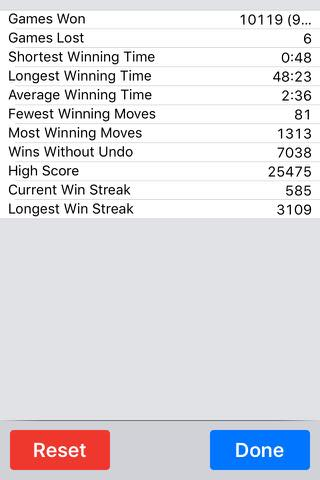

## 자기 소개서 

여기서는 제가 레진에서 하고 싶은 일과 기여할 수 있는 부분들, 그리고 살아온 배경에 대해서 설명드립니다.

## 왜 레진에 지원하려고 하는가?

레진에 게임 개발자로 지원하려는 이유에는 크게 **두 가지**가 있습니다.

첫째는 한 명의 개발자로서 **세상에 기억될 것을 만들고 싶다**는 소망을 가지고 있기 때문입니다. 현재는 모두의연구소에서 매니저로 일하면서 동시에 1인 개발자로 iOS 게임을 개발하고 있는데 아무래도 주업무가 개발이 아니다보니 개발에만 몰두하고 싶다는 생각을 하게 되었습니다.

둘째는 Swift 언어로 iOS 앱을 개발을 하던 중 최근에 게임 외에도 iMessage 스티커 등 **레진의 컨텐츠로 매출을 향상시킬 수 있는 기회**가 생기는 것을 보고 이를 레진과 함께 구현하면 좋겠다고 생각했기 때문입니다.

## 레진에 제안하고자 하는 것은 무엇인가?

저는 게임 개발자로 지원하지만, 레진의 입장에서는 **컨텐츠를 활용해서 매출을 키울 수 있는 제품을 만드는 것**이 중요한 것이지, 그 제품이 반드시 게임이어야 하는 것은 아니라고 생각합니다. 

따라서, 제안할 내용을 크게 게임 부분과 비게임 부분으로 나누어서 게임 외에도 레진의 매출 증대에 도움이 될 수 있는 내용을 따로 정리하였습니다.

1. **게임** 부분
	* Unity, Unreal Engine에 더하여 애플의 게임 엔진인 **SpriteKit**과 **SceneKit**을 사용한 게임을 제작하기를 제안드립니다. 
	* **SpriteKit**과 **SceneKit**을 사용할 경우의 장점은 다음과 같습니다.
		* 최근 애플에서 게임 분야에 지원을 강화하고 있는데, SpriteKit과 SceneKit은 따로 **라이센스 비용이 없습니다**.
		* **watchOS, tvOS** 등 기존에 없던 **신규 시장에 진출해서 선점 효과**를 얻을 수 있습니다.
		* iOS **표준 UI** 및 **In-App purchase** 등의 기술과 자연스럽게 연동할 수 있습니다.
	* 게임 제작에 필요한 기술은 게임 엔진과는 상관없이 동일하므로 Unity, Unreal Engine으로 제작된 게임도 그대로 옮길 수 있습니다.
		
2. **비게임** 부분
	* 카카오톡의 사례에서 보듯 이미 있는 시장보다는 **새로 생기는 시장에 진출하는 것이 유리**합니다. 
	* 최근 애플에서 **iOS 메시지용 스티커 시장**을 새로 만들었습니다. 
	* 이 시장은 올해 9월 말에 정식으로 런칭될 것이라 타이밍상 지금 **레진에서 진입하기에 아주 이상적**이라고 생각합니다.
	* iOS 메시지 스티커는 해외, 특히 미국에서 많이 사용할 것이므로 **레진의 케릭터를 해외에 홍보하는 효과**도 얻을 수 있습니다.

## 어떻게 레진에 기여할 수 있는가?

위의 제안에 대해서 제가 레진에 기여할 수 있는 부분을 정리하면 다음과 같습니다.

1. **다양한 분야의 게임**에 대해서 프로토타입을 만들 수 있습니다.
	* [포트폴리오](2016-07-21-Portfolio.md)를 보시면 아시겠지만 Swift로 다양한 게임을 제작해 본 경험이 있습니다.
	* 필요하면 Unity, Unreal Engine을 사용해서 게임을 제작할 수도 있으며, Swift를 사용하면 바로 게임을 제작할 수 있습니다.
	
2. iMessage 앱 등 **신규 시장에 진출하여 새로운 매출**을 창출하는데 도움을 드릴 수 있습니다.
	* Swift는 범용 언어이므로 iMessage나 다른 일반 앱처럼 게임 이외의 앱 제작도 가능합니다.
	* watchOS, tvOS 등의 신규 시장을 위한 제품을 만들 수 있습니다.

3. **Swift로 다양한 분야의 개발**을 할 수 있습니다.	
	* Swift는 애플에서 오픈 소스로 공개한 이후 서버부터 프론트 엔드까지 다양한 분야의 개발에 사용됩니다.
	* 최근 구글에서도 Swift를 고려할 정도로 Swift는 다른 플랫폼용 개발 언어로도 확장되고 있습니다.

4. **메카닉 설계나 설정 구축에 도움**을 드릴 수 있습니다.
	* 전공이 기계공학이며 그 중에서 기계 설계를 전공했던 적이 있어서 게임이나 컨텐츠 설정시에 도움을 드릴 수 있습니다. 

## 어떻게 살아왔고 또 살아가려고 하는가?

저의 삶을 간단하게 요약하면 다음과 같습니다.

1. 가정 환경 
	*  [이력서](2016-07-12-Resume.md)를 보시면 아시겠지만 대학교 생활을 남들보다 오래한 편입니다. 
	* 어릴 때부터 넉넉하게 자라지는 못했기 때문에 대학교에 다니면서 돈을 벌어야 했습니다. 
	* 그래서 휴학하면서 일하는 기간이 많아서 졸업할 때까지 시간이 많이 걸리게 되었습니다.

2. 대학 동아리 활동
	* 기계 공학이 전공이라 로봇을 제어하기 위해 C/C++을 배우기 시작했습니다.
	* 돈을 벌어야 해서 공부한 프로그래밍 기술로 아르바이트를 시작하게 되었고, 이 시기에는 그냥 닥치는 대로 일했었습니다.
	* 학술 동아리 [Mechatronics 회장](http://mecha.namoweb.net/xe/History)으로 있으면서 네발이라는 로봇 소스를 1999년도에 인터넷에 공개한 적이 있습니다.
	* 회장으로 있을 당시에 Mechatronics 동아리의 [앰블럼](http://mecha.namoweb.net/xe/CI)도 제작했습니다.

3. 서울 생활
	* 현재 건강을 위해 매일 아침 7시에 수영을 하고 있습니다.
	* 모두의연구소라는 곳에서 매니저 활동을 하면서 다양한 모임에 참여하고 있습니다.
	
	* 영어는 일단 간단한 대화는 가능하고, 영어 문서와 동영상을 보는데 지장이 없습니다.

4. 잘 하는 게임
	* FreeCell : 몇몇판의 세계 기록을 가지고 있습니다.
	*  
	* 위의 기록은 시간, 이동 횟수, 최종 점수 모두 세계 기록을 갱신한 화면을 찍어둔 것입니다. 	
5. 게임외에 덕질 하는 것
	* Swift : C++ 이후로 제 2의 인생을 살고 있는 느낌을 줍니다.
	* 지도 보는 것을 좋아합니다. 
		* 예전에는 구글 어스는 매일 보다시피 했습니다. 
		* 현재는 맥을 쓰다보니 국내는 다음 지도를 보고 해외는 애플 지도를 자주 보고 있습니다.

## 기타 

* 제출 자료는 iOS 앱이라 바로 드릴 수 없어서 동영상 링크 및 이미지로 대체하고, 실제 구현 파일 등은 가능하면 현장에서 직접 보여드리도록 하겠습니다.
* 서울에서 좋은 인연을 많이 만나게 되었습니다. 이번에도 하나의 좋은 인연이 되었으면 합니다. 고맙습니다.

## 관련 문서

* [이력서](2016-07-12-Resume.md)
* [경력 기술서](2016-07-21-Employment-Highlight.md)
* [포트폴리오](2016-07-21-Portfolio.md)