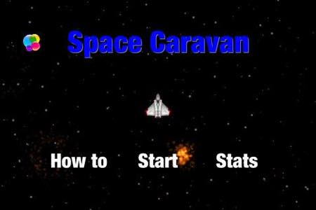
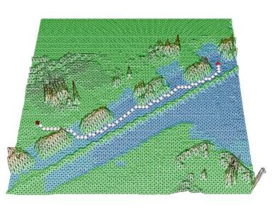
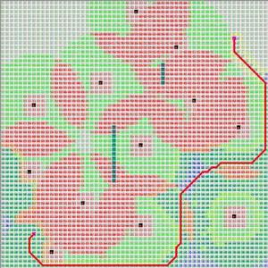
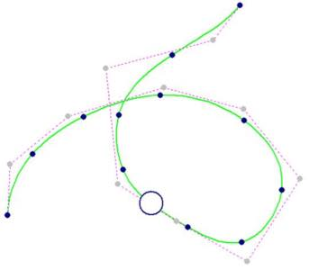
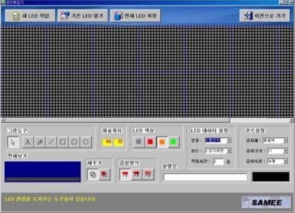
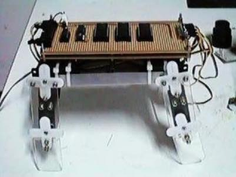
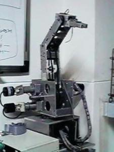

## 이력서 

## 개인 정보

* 이름 : **김민호**
* 사진 : 
* 생일 : 1976년 4월 24일

* 연락처
	* 전화 : 010-2561-9570
	* 메일 : xho1995@gmail.com

## 경력 사항

* **2016년  1월 ~** : 대안 대학원인 [모두의연구소](http://www.modulabs.co.kr/) 매니저
	* **2016년 3월 ~** : 모두의연구소 [**Swift** 프로그래밍 스터디](http://www.modulabs.co.kr/Swift_library/848) 모임 연구실장
	* **2016년 1월 ~** :  모두의연구소 가상현실 연구실 모임 **[VRtooN](http://www.modulabs.co.kr/Swift_library/848)** 연구원

* **2014년 11월 ~** : 1인 소프트웨어 개발 기업 Void Systems CEO 겸 개발자
	* **2016년  5월 ~** : 모바일용 [96 대리운전](https://itunes.apple.com/us/app/96daeliunjeon/id1119085448?mt=8) 앱의 iOS 버전 제작
	* **2016년 2월** : [LunaIoT 프로젝트](https://github.com/kmansoo/Luna/)에 참여하여 RESTful API를 활용하여 iOS 앱 제작
	* **2016년 1월 ~** : Swift 관련 블로그 ( [http://xho95.github.io](http://xho95.github.io) ) 운영
	* **2015년 8월 ~** : 분당 Swift 스터디 모임 **[StudyiOS](http://studyios.gitlab.io)** 참여
	* **2015년 8월** : iOS용 게임 [Space Caravan](https://itunes.apple.com/kr/app/space-caravan/id1011757460?mt=8) 출시
	* **2015년** : [선형 대수](https://www.facebook.com/groups/1045080912185263/) 스터디 모임 참여
	* **2015년 1월 ~** : 수원 [**C++** 스터디 모임](http://cafe.naver.com/multism) 참여	
	* **2014년 11월** : iOS 모바일 앱 제작 회사 Void Systems 창업

    
	
* **2010년 3월 ~ 2014년 10월** : 부산대학교 기계공학부 박사 과정
	* **2014년** : [부산 모바일 앱 센터](http://www.bmac.kr/index.asp) 교육 수강 : Unity, C++ 게임 엔진, MongoDB 등
	* **2013년 2월** : 부산대학교 기계공학부 박사 수료
	* C++로 **3차원 격자 지도 생성 알고리즘** 개발 - [관련 논문1](http://ieeexplore.ieee.org/stamp/stamp.jsp?arnumber=6677377)
		* UGV has widely used in the battlefield, thus UGV's survivability technique has become one of the main issue on the path planning algorithm. In this study, 3D survivability map is suggested for UGV survivability, and the optimal path planning algorithm on this map is also suggested. 3D survivability map is a grid map on which the 3D terrain data is combined with the battle field data, and each grid node on the map has UGV's survival probability value. The suggested path planning algorithm finds the optimal path by comparing the survival probability value of the grid nodes. At last, the simulation program has been developed, and the results are shown to verify the suggested algorithm.
	* C++로 생존율을 고려한 **확장된 A* 경로 탐색 알고리즘** 개발 - [관련 논문1](http://ieeexplore.ieee.org/xpls/abs_all.jsp?arnumber=6463003), [관련 논문2](http://link.springer.com/chapter/10.1007%2F978-3-642-33503-7_59)
		* There are a lot of researches on the path planning algorithm of the unmanned vehicle. Previous researches related to the path planning mainly focused on finding the shortest path on the given map. However, on the battle field, if the vehicle just moves along the shortest path, it could not reach the goal, because of the enemy’s attack. Therefore it’s necessary that the new path planning algorithm for the unmanned vehicle on the battle field.
In this paper, we will suggest a new path planning algorithm for the vehicle on the battle field using extended A* algorithm with survivability. For this, we will define the survivability and develop the additional cost function to find the optimal path in this situation.
  
	
* **2005년 3월 ~ 2007년 2월** : 	부산대학교 기계공학부 석사 과정
	* **2007년 2월** : 부산대학교 기계공학부 석사 졸업
	* C++로 **B-spline 곡선 경로 생성 프로그램** 개발 - [관련 논문1](http://ocean.kisti.re.kr/downfile/volume/icase/JOJDCV/2014/v20n2/JOJDCV_2014_v20n2_138.pdf), [관련 논문1](http://ieeexplore.ieee.org/xpl/articleDetails.jsp?reload=true&arnumber=5670133)
		* This research presents an A\* based algorithm which can be applied to Unmanned Ground Vehicle self-navigation in order to make the driving path smoother. Based on the grid map, A* algorithm generated the path by using straight lines. However, in this situation, the knee points, which are the connection points when vehicle changed orientation, are created. These points make Unmanned Ground Vehicle continuous navigation unsuitable. Therefore, in this paper, B-spline curve function is applied to transform the path transfer into curve type. And because the location of the control point has influenced the B-spline curve, the optimal control selection algorithm is proposed. Also, the optimal path tracking speed can be calculated through the curvature radius of the B-spline curve. Finally, based on this algorithm, a path created program is applied to the path results of the A* algorithm and this B-spline curve algorithm. After that, the final path results are compared through the simulation.
		* Nowadays, the research of the unmanned vehicle robots is increased, especially in the military fields. Some of these robots use path tracking algorithm, so the path generation method is needed. Now we suggest that the path generation method could be used into augmented reality using the B-spline curve equation. Therefore we can make the robot can track the virtual path in real time by obtaining the error distance between the path in the augmented reality and the robot.
	* 군사용 로봇인 **[Field Robot](https://www.youtube.com/watch?v=nrXtmwM93FE)** 제작

  

* **2002년 ~ 2003년** : 주식회사 CMK 개발 부서 근무
	*  C++ Builder로 부산 **지하철 문안 편집기** 개발 

* **1995년 3월 ~ 2005년 2월** : 부산대학교 기계공학부 재학
	* **1998년 8월 ~ 1999년 7월** : 부산대학교 로봇동아리 [Mechatronics](http://mecha.namoweb.net/xe/) 회장
	* **1998년** : 4족 보행 로봇 [네발이](http://mecha.namoweb.net/xe/Robot/428)의 제어 프로그램 개선
	* **1996년** : 6축 다관절 로봇 [Hexis](http://mecha.namoweb.net/xe/Robot/426)  제작
	* **1996년** : C++로 DOS용 게임 Sonar 제작
	* **1995년 ~ 2005년** : 부산대학교 로봇동아리 Mechatronics 회원

  

