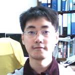

## 이력서 

## 개인 정보

* 이름 : **김민호**
* 사진 : 
* 생일 : 1976년 4월 24일

* 연락처
	* 전화 : 010-2561-9570
	* 메일 : xho1995@gmail.com

## 경력 사항

* **2016년  1월 ~** : 대안 대학원인 [모두의연구소](http://www.modulabs.co.kr/) 매니저
	* **2016년 3월 ~** : 모두의연구소 [**Swift** 프로그래밍 스터디](http://www.modulabs.co.kr/Swift_library/848) 모임 연구실장
	* **2016년 1월 ~** :  모두의연구소 가상현실 연구실 모임 **[VRtooN](http://www.modulabs.co.kr/Swift_library/848)** 연구원

* **2014년 11월 ~** : 1인 소프트웨어 개발 기업 Void Systems CEO 겸 개발자
	* **2016년  5월 ~** : 모바일용 [96 대리운전](https://itunes.apple.com/us/app/96daeliunjeon/id1119085448?mt=8) 앱의 iOS 버전 제작
	* **2016년 2월** : [LunaIoT 프로젝트](https://github.com/kmansoo/Luna/)에 참여하여 RESTful API를 활용하여 iOS 앱 제작
	* **2016년 1월 ~** : Swift 관련 블로그 ( [http://xho95.github.io](http://xho95.github.io) ) 운영
	* **2015년 8월 ~** : 분당 Swift 스터디 모임 **[StudyiOS](http://studyios.gitlab.io)** 참여
	* **2015년 8월** : iOS용 게임 [Space Caravan](https://itunes.apple.com/kr/app/space-caravan/id1011757460?mt=8) 출시
	* **2015년** : [선형 대수](https://www.facebook.com/groups/1045080912185263/) 스터디 모임 참여
	* **2015년 1월 ~** : 수원 [**C++** 스터디 모임](http://cafe.naver.com/multism) 참여	
	* **2014년 11월** : iOS 모바일 앱 제작 회사 Void Systems 창업
	
* **2010년 3월 ~ 2014년 10월** : 부산대학교 기계공학부 박사 과정
	* **2014년** : [부산 모바일 앱 센터](http://www.bmac.kr/index.asp) 교육 수강 : Unity, C++ 게임 엔진, MongoDB 등
	* **2013년 2월** : 부산대학교 기계공학부 박사 수료
	* C++로 **3차원 격자 지도 생성 알고리즘** 개발 - [관련 논문1](http://ieeexplore.ieee.org/stamp/stamp.jsp?arnumber=6677377)
	* C++로 생존율을 고려한 **확장된 A* 경로 탐색 알고리즘** 개발 - [관련 논문1](http://ieeexplore.ieee.org/xpls/abs_all.jsp?arnumber=6463003), [관련 논문2](http://link.springer.com/chapter/10.1007%2F978-3-642-33503-7_59)
	
* **2005년 3월 ~ 2007년 2월** : 	부산대학교 기계공학부 석사 과정
	* **2007년 2월** : 부산대학교 기계공학부 석사 졸업
	* C++로 **B-spline 곡선 경로 생성 프로그램** 개발 - [관련 논문1](http://ocean.kisti.re.kr/downfile/volume/icase/JOJDCV/2014/v20n2/JOJDCV_2014_v20n2_138.pdf)
	* 군사용 로봇인 **[Field Robot](https://www.youtube.com/watch?v=nrXtmwM93FE)** 제작
* **2002년 ~ 2003년** : 주식회사 CMK 개발 부서 근무
	*  C++ Builder로 부산 **지하철 문안 편집기** 개발 
* **1995년 3월 ~ 2005년 2월** : 부산대학교 기계공학부 재학
	* **1998년 8월 ~ 1999년 7월** : 부산대학교 로봇동아리 [Mechatronics](http://mecha.namoweb.net/xe/) 회장
	* **1998년** : 4족 보행 로봇 [네발이](http://mecha.namoweb.net/xe/Robot/428)의 제어 프로그램 개선
	* **1996년** : 6축 다관절 로봇 [Hexis](http://mecha.namoweb.net/xe/Robot/426)  제작
	* **1996년** : C++로 DOS용 게임 Sonar 제작
	* **1995년 ~ 2005년** : 부산대학교 로봇동아리 Mechatronics 회원
