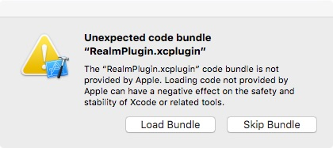

## Realm

Realm은 모바일용 DB로 무료입니다.[^Realm] 물론 iOS에서도 사용할 수 있으며 Swift로도 잘 작동합니다.[^Realm-Swift]

Realm 같은 경우 Xcode 플러그인을 설치하면 프로젝트에 File 메뉴를 통해서 Realm Model Object를 바로 만들 수 있습니다. Xcode 플러그인을 설치하려면 [Alcatraz](http://alcatraz.io)를 사용하면 됩니다.[^Alcatraz] 

다만 플러그인을 설치하고 나면 Xcode를 실행할 때마다 아래와 같은 대화창이 뜹니다. 

매번 뜨는 것을 막을 수는 없는지 아직 잘 모르겠습니다. 

> 아마 Swift Package Manager가 공식적으로 사용되면 Alcatraz를 대체하게되지 않을까 생각합니다. 

문서 자체는 잘 되어 있고, 한글 번역도 훌륭하시면 공식 문서에 튜토리얼에 해당하는 문서가 없는 것 같습니다. 처음 시작하면서 따라하기 위해서는 [RayWenderlich](https://www.raywenderlich.com) 사이트에 있는 [Realm Tutorial: Getting Started](https://www.raywenderlich.com/112544/realm-tutorial-getting-started) 자료를 활용하면 좋을 것 같습니다.[^Ray]

## 참고 자료

[^Realm]: 공식 사이트는 [Realm](https://realm.io)입니다.

[^Realm-Swift]: Swift 쪽의 공식 문서는 [Realm Swift](https://realm.io/docs/swift/latest/#getting-started)입니다.

[^Alcatraz]: [Alcatraz](http://alcatraz.io)는 Xcode에 프러그인을 설치할 수 있게 해주는 Package Manager입니다. 사용해보니 조금 불안정한 것 같습니다. Swift Package Manager 이후로 어떻게 변화될지 궁금합니다. 

[^Ray]: [Realm Tutorial: Getting Started](https://www.raywenderlich.com/112544/realm-tutorial-getting-started)에 나와있는 자료는 Realm이 아니라도 MapKit의 사용법 자체로도 훌륭한 자료인 것 같습니다. 