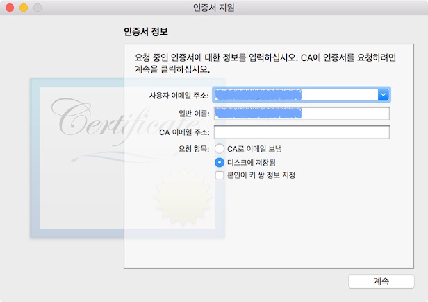

오늘은 맥에서 개발자 인증서 관련 작업에 대해서 정리하도록 합니다. 

앱을 앱스토어에 등록하려면 반드시 거쳐야하는 과정이지만, 예전과 방식이 달라서 할 때마다 조금씩 실수를 하면서 했었는데, 이번에 따로 정리하였습니다.

앞으로 또 수정 사항이 생기면 업데이트를 할 것입니다.

### 인증서 요청 파일 만들기

우선 맥에서 인증서 요청 파일을 만들어야 합니다. 인증서 요청 파일은 **키체인 접근**이라는 앱에서 실행합니다. **키체인 접근**을 실행하고 메뉴에서 **키체인 접근 > 인증서 지원 > 인증 기관에서 인증서 요청...**을 선택하면 아래와 같이 인증서 지원이라는 대화창이 나타납니다. 

이 창에서 이메일 주소와 이름을 입력하고 **요청 항목**을 **디스크에 저장됨**으로 설정합니다.
대화창에서 계속을 선택하면 파일을 저장할 위치를 정하게 되는데 자신이 원하는 곳에 저장하면 됩니다. 
그러면 해당 위치에 CertificateSigningRequest.certSigningRequest 파일이 생깁니다.

이 파일을 애플 개발자 사이트에 업로드 해서 인증서를 만들게 됩니다.

### App ID 만들기

이제 개발자 계정에서 App ID를 만들어야 합니다. 예전에는 애플 개발자 사이트에서 수동으로 ID를 만들었습니다. 하지만, 이제는 Xcode에서 Bundle Identifier를 설정하면 자동으로 웹과 연동되어서 생기게 됩니다. 

#### Xcode에서 Bundle Identifier 만들기

Xcode에서 Bundle Identifier를 만드는 방법도 예전과는 다르게 자동화되어 있습니다. Xcode에서 새 앱을 만들 때, 앱의 이름을 가지고 자동으로 만들어 줍니다. 따라서 Xcode에서 한번만 설정하면 편리하게 작업할 수 있습니다. 

### 인증서 만들기

### 고찰하기

각각의 과정이 어떤 의미를 가지고 있는지 알아야 할 필요도 있습니다. 관련 사이트의 정보를 보고 공부가 필요할 것 같습니다. 

### 참고 자료

[iOS - Provisioning profile 만들기](http://korea-developer.tistory.com/entry/iOS-Provisioning-profile-만들기)

