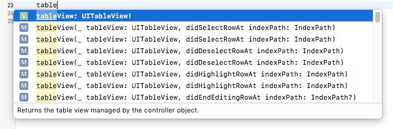

가끔가다가 Xcode에서 코드 자동완성(Auto Complete) 기능이 잘 안되는 경우가 있습니다. 

물론 가끔 발생할 정도로 자주 일어나는 일은 아니지만 한 번 발생하니까 상당히 불편했습니다. 특히 코코아 프레임웍(Cocoa Framework)에서는 오버로딩 함수를 많이 사용하는데 코드 자동 완성 기능없이 수동으로는 사실상 함수명을 입력할 수 없는 경우가 많습니다. 

인터넷으로 해결 방법을 찾아봤는데, 왜 되는지는 모르겠지만 stackoverflow의 [Xcode 7.3 autocomplete is so frustrating](http://stackoverflow.com/questions/36169099/xcode-7-3-autocomplete-is-so-frustrating) 답글 중에서 evanflash님과 Hashem Aboonajmi님의 답변 대로 하니까 문제가 해결되는 것 같습니다. [^stackoverflow-36169099]

여기서는 Xcode에서 코드 자동완성 기능이 잘 작동하지 않을 경우의 해결 방법에 대해서 정리합니다. 

#### 해결 방법

먼저 파인더에서 **Xcode > Preferences > Locations > Derived Data** 폴더로 이동합니다. 해당 폴더의 실제 위치는 아래와 같습니다. 

```
/Users/username/Library/Developer/Xcode/DerivedData
```

그런데 위의 폴더는 파인더를 뒤져서는 접근할 수 없습니다. 이럴 경우 파인더에서 특정 폴더로 바로 이동을 해야합니다. 

파인더에서 특정 폴더로 바로 이동하는 것은 파인더의 **이동 > 폴더로 이동...** 메뉴를 이용하면 됩니다. 파인더에서 Commnd-Shift-G 단축키를 눌러도 됩니다.

폴더로 이동... 메뉴를 선택해서 나타나는 입력창에 위의 주소를 붙여 넣고 `username`을 자신의 로그인 사용자 명으로 바꾸면 파인더가 알아서 진짜 폴더 경로를 인식합니다.

**이동** 버튼을 눌러서 **DerivedData** 폴더로 이동합니다. 해당 폴더의 내용을 지웁니다. (일종의 캐시 폴더인 듯 합니다.) 

마지막으로 Xcode를 재시작합니다. 



위의 그림과 같이 Autocomplte가 원래대로 잘 되는 것을 볼 수 있습니다. 

### 고찰하기

솔직히 설명을 읽어도 왜 되는지는 모르겠지만, 작동은 잘 됩니다. 기회가 되면 작동 이유에 대해서 살펴볼 필요가 있습니다.

### 참고 자료

[^stackoverflow-36169099]: [Xcode 7.3 autocomplete is so frustrating](http://stackoverflow.com/questions/36169099/xcode-7-3-autocomplete-is-so-frustrating) : 원래 설명은 evanflash님이 했지만 실제로 따라할 수 있는 설명은 Hashem Aboonajmi님이 해서, 그대로 따라 했습니다.