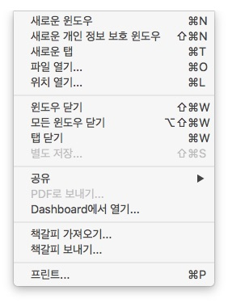

맥에서 메뉴를 캡쳐하는 방법을 정리합니다. 

[How to capture menus and windows](http://www.macworld.com/article/1158931/screenshots_shortcuts.html) 라는 글을 참고 했습니다. [^macworld] 

> 사실 예전부터 알고 있었지만 메뉴도 되는지는 잘 몰랐습니다. [^macnews]

command-shift-4 키를 누릅니다. 그러면 커서를 움직일 수 있는데 캡쳐하고 싶은 대상에 커서를 두고 스페이스바를 누릅니다. 

그러면 아래와 같이 해당 메뉴만 따로 스크린샷으로 저장되는 것을 볼 수 있습니다. 

다른 자료를 보고 열심히 정리했는데, 애플 공식 문서의 [Mac에서 스크린샷을 찍는 방법](https://support.apple.com/ko-kr/HT201361) 라는 글에 따로 메뉴 스크린샷 찍기로 설명이 되어 있는 것을 확인했습니다. [^apple]

#### 기타 

command-shift-3 은 전체 스크린을 캡쳐합니다.

command-shift-4 는 화면을 고정시켜서 어디를 캡쳐할 지를 지정할 수 있습니다. 이 때 영역이 선택되면 스페이스바를 누르면 됩니다.
 
### 참고 자료

[^apple]: [Mac에서 스크린샷을 찍는 방법](https://support.apple.com/ko-kr/HT201361)

[^macworld]: [How to capture menus and windows](http://www.macworld.com/article/1158931/screenshots_shortcuts.html)

[^macnews]: [OS X에서 화면을 캡쳐하는 방법 총정리 - 그리고 잘 알려져 있지 않는 숨은 기능 소개](http://macnews.tistory.com/498)