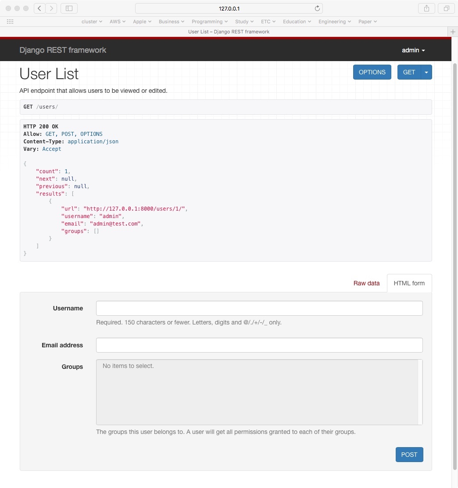

여기서는 Django에서 사용할 수 있는 대표적인 Rest 프레임웍(Framework)인 [Django REST framework](http://www.django-rest-framework.org)에 대해서 정리합니다. [^django-rest-framework]

전체 내용은 Django REST framework 홈페이지의 내용을 실습하고 정리한 것입니다. 

* [Rest Framework 맛보기](../_draft/2016-12-19-Django-REST-Framework.md)
* [Quick Start]()

### 프로젝트 시작하기

```
$ django-admin.py startproject tutorial .
```

위에서 마지막에 찍는 `.`의 의미는 아직 잘 모르겠습니다. 홈페이지에도 아직 설명이 없는 것 같습니다. [^tutorial-quickstart]

### Serializers

```
class UserSerializer(serializers.HyperlinkedModelSerializer):
    class Meta:
        model = User
        field = ('url', 'username', 'email', 'groups')
```

위와 같은 코드에서 `HyperlinkedModelSerializer` 어떤 관계를 나타낸다고 합니다. 여러가지 종류가 있지만 hyperlinking 관계가 좋은 RESTful 디자인이라고 합니다.

나중에 차차 알게되면 정리해야할 것 같습니다.

### Views

```
class UserViewSet(viewsets.ModelViewSet):
    """
    API endpoint that allows users to be viewed or edited.
    """
    queryset = User.objects.all().order_by('-date_joined')
    serializer_class = UserSerializer

```

ViewSets 이라는 것을 사용하게 되면 여러개의 뷰(views)를 따로 만들 필요가 없이 공통 기능들을 함께 묶어서 표현할 수 있다고 합니다.

필요하다면 독립적인 뷰들로 쉽게 분리할 수도 있지만, viewsets을 사용하는 것이 로직을 간결하게 구성하게 해준다고합니다.

### URLs

```
router = routers.DefaultRouter()
router.register(r'users', views.UserViewSet)
router.register(r'groupts', views.GroupViewSet)

urlpatterns = [
    url(r'^', include(router.urls)),
    url(r'^api-auth/', include('rest_framework.urls', namespace='rest_framework'))
]
```

뷰 대신에 viewsets을 사용했기 때문에 자동으로 URL conf을 생성해서 API에 연동할 수 있습니다. 이를 위해서는 단순히 viewsets을 router 클래스에 등록하기만 하면 됩니다.

API URLs에 대해 더 많은 기능이 필요하다면 예전처럼 일반적인 클래스 기반 뷰(class-based views)를 사용해서 URL conf를 직접 설정하면 된다고 합니다.

마지막으로 기본(default) 로그인 로그아웃 뷰(login and logout views)를 추가했는데, 꼭 할 필요는 없지만, API에서 인증이 필요하고 browsable API를 사용하고 싶을 때 편리하다고 합니다.

### Settings

글로벌 설정을 **settings.py** 파일에 합니다.

```
INSTALLED_APPS = (
    ...
    'rest_framework',
)

REST_FRAMEWORK = {
    'DEFAULT_PERMISSION_CLASSES': [
        'rest_framework.permissions.IsAdminUser',
    ],
    'PAGE_SIZE': 10
}
```

위의 설정은 페이지 기능(pagination)을 켜고 API를 관리자만 접근하도록 합니다.

### 결과 보기 

#### 터미널에서 결과 보기

```
$ curl -H 'Accept: application/json; indent=4' -u admin:password123 http://127.0.0.1:8000/users/
```

서버를 실행하고 터미널에서 위와 같이 curl 명령을 실행하면 다음과 같이 결과가 나타납니다. 

```
{
    "count": 1,
    "next": null,
    "previous": null,
    "results": [
        {
            "url": "http://127.0.0.1:8000/users/1/",
            "username": "admin",
            "email": "admin@test.com",
            "groups": []
        }
    ]
}
```

#### 브라우저에서 결과 보기

브라우저 주소창에 `http://127.0.0.1:8000/users/`를 입력하면 아래와 같은 결과가 나타납니다. 




### 참고 자료

[^tutorial-quickstart]: [Quickstart](http://www.django-rest-framework.org/tutorial/quickstart/)

