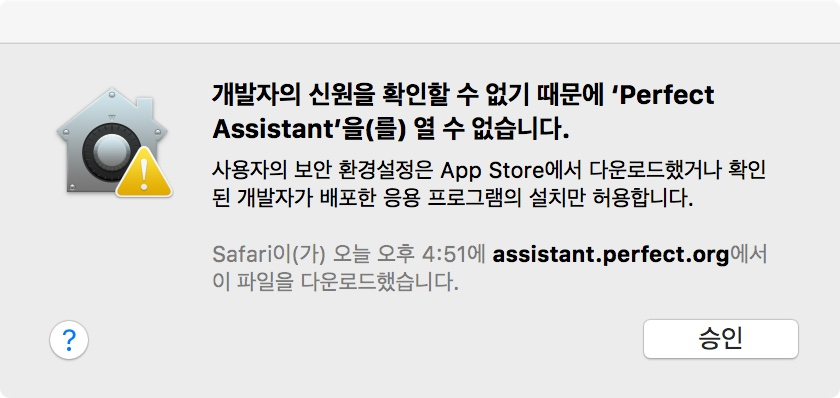
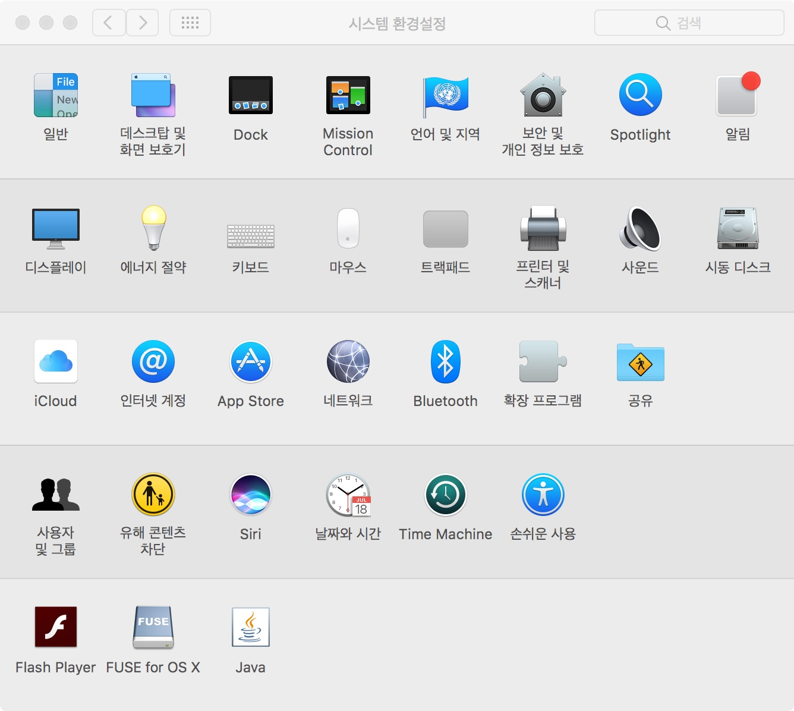
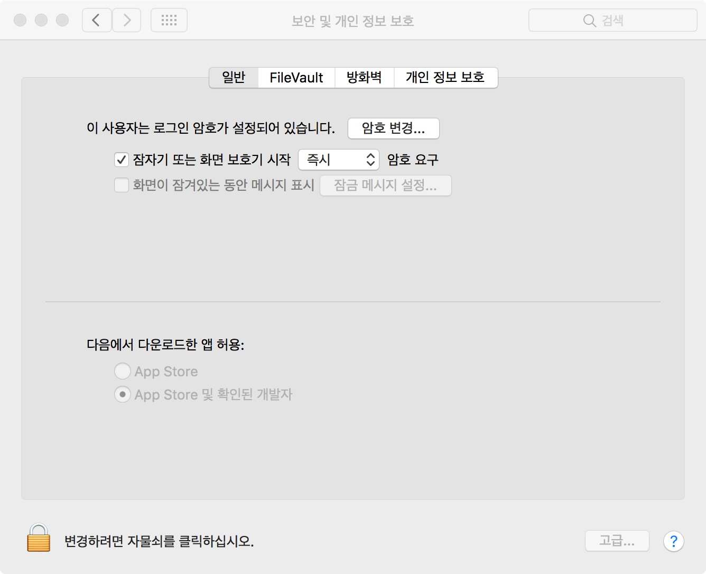

이 동영상의 내용은 예전 방식을 assistant 로 만들어 보는 것이 전부입니다. 실제 내용은 같고 이를 통해 assistant 와 docter 등등에 대한 내용만 맛보기로 알 수 있습니다. 

#### 개발자 신원 대화 상자가 뜨는 앱 열기

이 글을 통해서 아래의 문제를 해결하는 방법을 알 수 있습니다. 

일단 시스템 환경 설정을 엽니다.

보안 및 개인 정보 보호를 선택합니다. 

일반 탭에서 맨 마지막에 있는 **변경하려면 자물쇠를 클릭하십시오.** 옆의 자물쇠 그림을 클릭합니다. 

비밀 번호를 넣습니다.

보안 및 개인 정보 보호에서 **다음에서 다운로드한 앱 허용:** 옆에 있는 Open Anyway 버튼을 누릅니다. 그러면 앱을 열 수 있습니다.

앱을 열고 나면 다시 자물쇠를 잠급니다. 자물쇠를 잠궈도 그 다음부터는 항상 앱을 열 수 있습니다.

### 참고 자료

[Server Side Swift with Perfect: Introduction to Perfect Assistant](https://videos.raywenderlich.com/screencasts/server-side-swift-with-perfect-introduction-to-perfect-assistant)