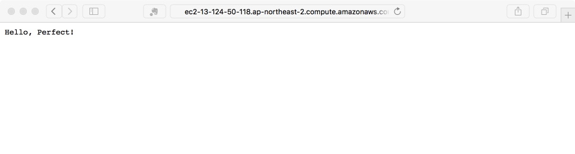

### AWS 설정하기

#### AWS CLI 설치하기

```
$ brew install awscli
```

```
$ aws configure

AWS Access Key ID [None]:
AWS Secret Access Key [None]:
Default region name [None]:  ap-northeast-2
Default output format [None]: json
```

```
$ aws ec2 describe-instances

{
    "Reservations": []
}
```

#### SSH 공개키 만들고 등록하기 

```
$ ssh-keygen -t rsa -C "perfect-key" -f ~/.ssh/perfect-key

Generating public/private rsa key pair.
Enter passphrase (empty for no passphrase): 
Enter same passphrase again: 
```

```
...

The key fingerprint is:
SHA256:... perfect-key
The key's randomart image is:
+---[RSA 2048]----+
|    o=o.     o.  |
|      ... ..o .. |
|      .. ....* o.|
|     o ... .+.O =|
|  o =   S .o++.B=|
| . E o o .o.oo..=|
|  + . o    o.   .|
|            .  .+|
|             ...o|
+----[SHA256]-----+
```

```
$ aws ec2 import-key-pair --key-name "perfect-key" --public-key-material file://$HOME/.ssh/perfect-key.pub

{
    "KeyName": "perfect-key", 
    "KeyFingerprint": "...:..."
}
```

#### Security Group 설정하기 

이것이 무엇인지는 아직 잘 모르겠습니다.

### Perfect Assistant 설정하기

#### EC2 Credentials 설정하기 

메인 화면에서 Configure EC2 Credentials 를 누릅니다. 

대화 상자에서 **Create** 를 눌러서 perfect 라는 EC2 Credential 을 새로 등록합니다. 저장한 접근 키와 비밀번호를 사용합니다.

#### 프로젝트 불러오기

메인 화면엥서 Import Existing Project 를 선택합니다. Integrate Linux builds with Xcode 는 해도 되고 안해도 되는 설정같습니다. 

Save 버튼을 누릅니다.

그러면 저장된 후 콘솔 창에 메시지가 뜹니다. 

#### 로컬에서 테스트하기

이제 BUILD 부분에서 Local 을 눌러서 로컬에서 테스트를 해봅니다. 이건 바로 건너뛰어도 되는 것 같습니다. 

```
Starting macOS build of /.../Hello-Perfect
Success.
```

RUN 에서 Local Exe 를 눌러서 로컬에서 테스트를 해봅니다. 그러면 서버가 실행됩니다. 브라우저에서 localhost:8080 으로 접속해서 결과를 확인할 수 있습니다.


### AWS 에 배포하기 

#### 배포하기 

이제 AWS 에 배포를 해봅니다. BUILD 에서 Deploy 버튼을 누릅니다.

대화상자에서 Create New... 를 선택합니다. 

AWS 를 선택합니다. 

CONFIGURATION NAME 은 perfect 로 합니다. 아무거나 상관없는 것 같습니다.

EC2 CREDENTIALS 은 좀 전에 만든 perfect 로 선택합니다.

SSH KEY 는 저장된 위치에서 private 키를 선택합니다. 

AVAILABLE INSTANCES 에서는 Add.. 를 선택해서 추가해준 Security Group 을 선택합니다. 

새로 뜨는 대화상자에는 그림과 같이 선택하면 됩니다. 

이 시점에서 이전에 region을 잘 맞춰야 합니다. 저의 경우 Seoul 로 옮겨서 새로 Security Group 을 만들었습니다. 

Launch 를 눌러 끕니다. 

콘솔에 Success 가 뜹니다.

Reload 를 여러번 눌러서 선택해서 Save 합니다.

메인 화면의 BUILD 에서 Deploy 를 선택해서 프로젝트를 perfect 로 선택해서 다시 Deploy 를 합니다. 왜 한 번 더 해야하는지는 모르겠습니다.

하지만 이렇게 해야 콘솔에서 실제 배포 작업이 이루어지는 것 같습니다. 이전 작업은 어떻게 보면 deploy를 위한 설정 작업이었다고 봅니다. 왜냐면 실제 deploy 버튼은 이제 누른 것입니다.

이 과정에서 콘솔을 보면 뭔가 내부적으로는 도커를 사용하고 있는 것 같습니다. 

이 과정이 생각보다 시간이 많이 걸리는 것 같습니다. 기다리다보면 결국 Success 가 뜹니다.

이제 EC2 콘솔에서 인스턴스를 선택해서 Public DNS 로 접속해보면 서버가 잘 동작한다는 것을 알 수 있습니다. 



나중에 실제 서비스를 만든다면 DNS 등을 설정하면 될 것입니다. _이부분은 좀 더확인하고 정리합니다._

#### 서버에 SSH 로 접속하기

필요하다면 AWS 서버에 SSH 키로 접속할 수 있습니다.

```
$ ssh -i ~/.ssh/perfect-key ubuntu@ec2-13-124-50-118.ap-northeast-2.compute.amazonaws.com
```

위와 같이 하면 콘솔이 AWS 에 있는 ubuntu 로 바뀝니다.

```
$ ls -al

total 44
drwxr-xr-x 5 ubuntu ubuntu 4096 Jan 12 19:36 .
drwxr-xr-x 3 root   root   4096 Sep 28 17:34 ..
-rw------- 1 ubuntu ubuntu 3235 Jan 12 19:37 .bash_history
-rw-r--r-- 1 ubuntu ubuntu  220 Aug 31  2015 .bash_logout
-rw-r--r-- 1 ubuntu ubuntu 3771 Aug 31  2015 .bashrc
drwx------ 2 ubuntu ubuntu 4096 Sep 28 17:44 .cache
-rw-rw-r-- 1 ubuntu ubuntu    0 Sep 28 17:47 .cloud-locale-test.skip
drwx------ 2 ubuntu ubuntu 4096 Sep 28 18:03 .lldb
-rw-r--r-- 1 ubuntu ubuntu  655 Jun 24  2016 .profile
drwx------ 2 ubuntu ubuntu 4096 Sep 28 17:34 .ssh
-rw-r--r-- 1 ubuntu ubuntu    0 Sep 28 17:47 .sudo_as_admin_successful
-rw------- 1 ubuntu ubuntu  625 Sep 28 18:02 .viminfo
-rw-rw-r-- 1 ubuntu ubuntu  166 Jan 12 19:34 .wget-hsts
```

서버에 잘 접속하는 것을 알 수 있습니다.

```
$ cd /
$ ls

bin             lib               proc   swift-3.0.2-RELEASE-ubuntu16.04
boot            lib64             root   sys
dev             lost+found        run    tmp
etc             media             sbin   usr
home            mnt               snap   var
initrd.img      opt               srv    vmlinuz
initrd.img.old  perfect-deployed  swift  vmlinuz.old
```

exit 명령으로 AWS 에서 로그아웃할 수 있습니다.

```
$ exit

logout
Connection to ec2-13-124-50-118.ap-northeast-2.compute.amazonaws.com closed.
```

이제 AWS 의 인스턴스를 terminate 합니다. 이것도 무슨 이유가 있을 것입니다.