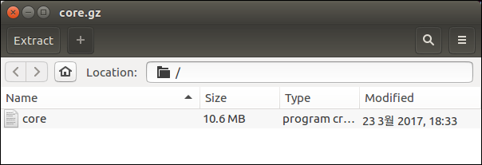

I need your help.

I have built a system to check sum computer hardware information with in server-client environments.

Finally I have built a pxe booting system with tiny core linux, and I succeed.

But my final goal is running my program on tiny core linux immediately after boot time.

So first of all I have remastered tiny core linux and changed the bootlocal.sh 



I have used Tiny Core Linux for pxe booting system

first of all, echo “hello, world” on bootlocal.sh file

and remastering with your wiki document

but cpio file is wrong

I followed like below steps

```
$ sudo mkdir /mnt/temp
$ sudo mount ~/Downloads/Tiny-Origin/TinyCore-current.iso /mnt/temp -o loop,ro
$ cp -a /mnt/temp ~/Documents/temp
$ sudo mv ~/Documents/temp/boot/core.gz ~/Documents/temp
$ sudo umount /mnt/temp
```

```
$ sudo mkdir ~/Documents/temp/extract
$ cd ~/Documents/temp/extract
$ zcat ~/Documents/temp/core.gz | sudo cpio -i -H newc -d
```

```
$ sudo vi bootlocal.sh
$ sudo geidt bootlocal.sh

echo "hello, world"
```

```
$ cd ~/Documents/temp/extract
$ sudo find | sudo cpio -o -H newc | gzip -2 > ~/Documents/core.gz
$ cd ~/Documents
$ advdef -z4 core.gz
```

```
$ cd ~/Documents/temp
$ sudo mv ~/Documents/core.gz boot
$ sudo mkdir newiso
$ sudo mv boot newiso
$ sudo mv cde newiso
$ sudo mkisofs -l -J -R -V TC-custom -no-emul-boot -boot-load-size 4 -boot-info-table -b boot/isolinux/isolinux.bin -c boot/isolinux/boot.cat -o TC-remastered.iso newiso
$ rm -rf newiso
```
