## 포트폴리오

제가 만들어 봤던 작품들을 시간 역순으로 정리했습니다.

이 글에 보인 앱 화면들은 모두 제 아이폰에서 실제로 테스트하면서 스크린샷을 찍은 것입니다.
  
전체 개발 경험을 보여드리기 위해 먼저 제 아이폰의 스크린샷을 보여드린 후 몇몇 중요 앱들에 대해 정리하도록 합니다.

* 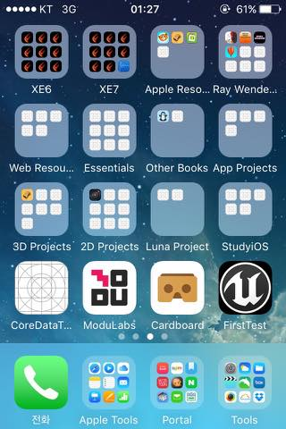

## 모바일 앱 제작

* 직접 출시 또는 제작해봤던 게임들과 개발해본 게임 관련 알고리즘을 소개합니다.
* 개발 언어는 Swift와 C++ 입니다.

### Vehicle : 게임 포팅

* 일자 : 2016년
* 장르 : 액션
* 소개 : 폰의 기울기로 차량을 제어하는 물리엔진이 적용된 간단한 3D 게임입니다.
* 특징 : Apple에서 Objective-C로 공개한 게임을 **Swift**로 옮겼습니다.
* 기술 : **Swift, SceneKit, GCD, Physics**
* 교재 : [SceneKit Vehicle Demo](https://developer.apple.com/library/ios/samplecode/SceneKitVehicle/Introduction/Intro.html)
* 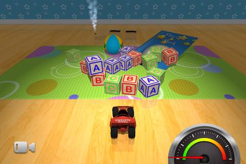

### 태양계 만들기

* 시기 : 2016년 제작
* 소개 : Apple에서 공개한 SceneKit 프레임웍으로 만든 간단한 태양계입니다.
* 특징 : Space Caravan의 배경을 위해 3D 게임에서 각 요소(Node)들의 상하관계를 실습할 목적으로 제작했습니다.
* 기술 : **SceneKit, SKNode, Physics, Image**
* 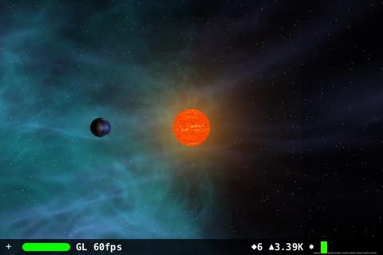

### Space Caravan : 게임 출시

* 일자 : 2015년 출시
* 장르 : 퍼즐
* 소개 : 서로 보이지 않는 상대방을 적은 턴으로 먼저 찾아서 없애는 2D 퍼즐 게임입니다.
* 특징 : Game Center를 사용하여 게임 순위 등을 볼 수 있으며, 영어로 제작하여 전세계 시장에 출시 했습니다.
* 진행 : 현재 2D로 만든 게임을 3D로 옮기기 위해 준비중입니다.
* 링크 : [AppStore - Space Caravan](https://itunes.apple.com/kr/app/space-caravan/id1011757460?mt=8)
* 데모 : [YouTube 게임 Play 영상](https://www.youtube.com/watch?v=NaOqtVGYlPg)
* 기술 : **SpriteKit, GameCenter, AVPlayer, Algorithm**
* 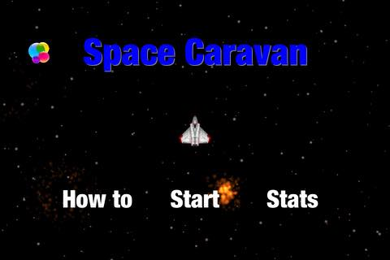

### 3차원 격자 지도 생성 알고리즘 

* 시기 : 2010년 ~ 2013년
* 소개 : 점군 데이터에서 3차원 지도를 생성하는 알고리즘입니다.
* 특징 : C++ Builder로 개발하였습니다.
* 기술 : **OpenGL, A* Algorithm, C++, STL**
* 링크 : [관련 논문1](http://ieeexplore.ieee.org/stamp/stamp.jsp?arnumber=6677377)
* 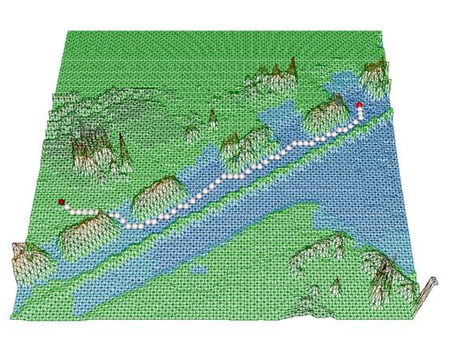

### Extended A* 경로 생성 알고리즘 

* 시기 : 2010년 ~ 2013년
* 소개 : 생존율을 고려하여 적들의 공격을 받는 환경에서 최선의 경로를 탐색하도록 A*를 확장한 경로 계획 알고리즘입니다.
* 특징 : C++ Builder로 개발하였으며 게임내 인공지능에 적용할 수 있습니다.
* 기술 : **A* Algorithm, C++, STL, AI**
* 링크 : [관련 논문1](http://ieeexplore.ieee.org/xpls/abs_all.jsp?arnumber=6463003), [관련 논문2](http://link.springer.com/chapter/10.1007%2F978-3-642-33503-7_59)

* 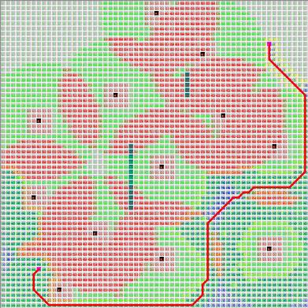

### B-Spline 곡선 경로 생성 알고리즘

* 시기 : 2006년
* 소개 : 조정점을 사용하여 연속 곡선 경로를 생성하는 알고리즘입니다.
* 특징 : 게임에 응용 가능
* 기술 : **B-Spline Algorithm, C++, STL, Mathematics**
* 링크 : [관련 논문1](http://ocean.kisti.re.kr/downfile/volume/icase/JOJDCV/2014/v20n2/JOJDCV_2014_v20n2_138.pdf)
* 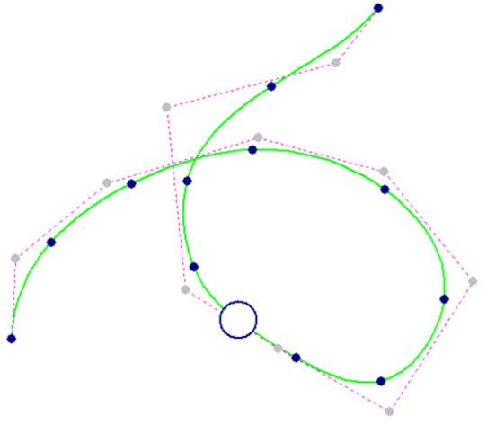

### Sonar : 게임

* 시기 : 1995년 
* 소개 : Space Caravan의 원형이 되는 게임으로 동작 방식이 유사합니다.
* 특징 : C++로 구현하였으며 DOS 상에서 **Bresenham 알고리즘** 사용하여 였습니다.
* 기술 : **Bresenham Algorithm, C++, Mathematics**
* 스크린샷은 DOS 용 게임이라 아쉽지만 없으며, 현재는 소스코드만 가지고 있습니다.

### 모두App

* 시기 : 2016년 
* 소개 : 회원관리를 위한 iOS앱으로 DB 부분 제작중이며 현재는 Intro만 완성된 앱입니다.
* 기술 : **Core Data, CoreAnimation, CoreGraphics, CALayer**
* 링크 : [모두App Intro 동작 영상](https://www.youtube.com/watch?v=VVDAZ4qvbFc)

### 96대리운전 

* 시기 : 2016년
* 소개 : 의뢰받아 제작했던 대리운전앱입니다.
* 특징 : WebView 기반으로 동작하는 대리운전앱입니다.
* 기술 : **WebView, NSURL, TabBar, FCM**
* 링크 : [AppStore - 96대리운전](https://itunes.apple.com/us/app/96daeliunjeon/id1119085448?mt=8)

### VR 스위치

* 시기 : 2016년
* 소개 : AFrame.io를 이용하여 제작해본 VR용 스위치입니다.
* 기술 : **AFrame.io, JavaScript**
* 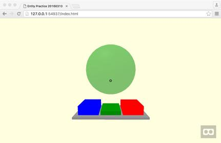

### LunaIoT 개발

* 시기 : 2016년
* 소개 : Luna 프레임웍 기반의 IoT용 컨트롤러입니다.
* 특징 : LunaIoT 프로젝트에서 iOS 앱을 담당하면서 [Contributor](https://github.com/kmansoo/Luna/graphs/contributors)로 등록되어 있습니다. 
* 기술 : **JSON, Parsing**
* 동작 : [LunaIoT 동작 영상](https://www.facebook.com/xho1995/videos/984864604886273/)
* 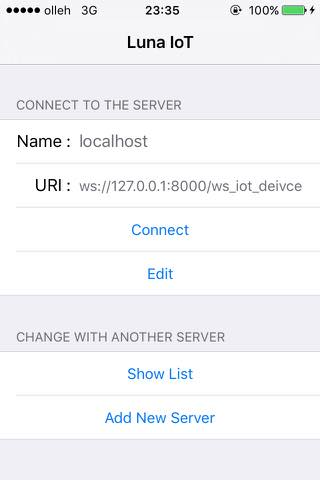

### Field Robot

* 시기 : 2006년
* 소개 : 장애물을 넘나드는 군사용 로봇입니다. 
* 특징 : 6개의 팔이 달린 바퀴를 가지고 장애물을 넘을 수 있습니다. 약 300kg의 무게를 들기위해 모터 토크 계산을 수행했습니다.
* 동작 : [YouTube 동작 영상](https://www.youtube.com/watch?v=nrXtmwM93FE)
* 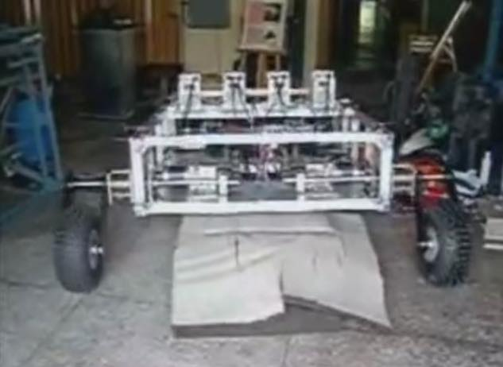

### Field Robot 모형

* 시기 : 2005년
* 소개 : 레고 마인드스톰으로 구현한 Field Robot 모형입니다. 
* 특징 : 실제 로봇을 만들기 전에 모형으로 가능성을 테스트하기 위해 제작하였습니다.
* 동작 : [Lego 모형 영상](https://www.youtube.com/watch?v=Wq7Q9rYvYxc)

### 지하철 LED 문안 편집기

* 시기 : 2003년
* 소개 : 부산 지하철내의 LED 전광판에 사용할 문안을 작성하는 편집기입니다.
* 특징 : 현재도 일부 부산 지하철에서는 이 편집기로 작성된 글이 사용되고 있습니다. 
* 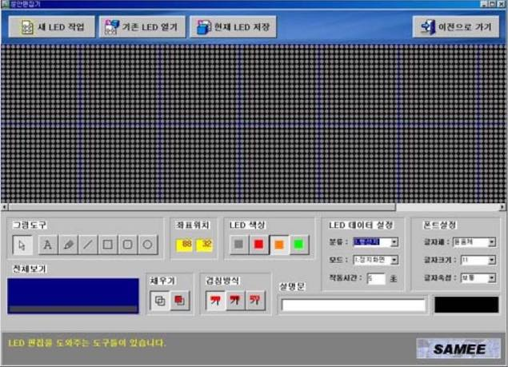

### 기어 치형 설계 프로그램

* 시기 : 2000년
* 소개 : 정해진 조건으로 기어 치형을 설계하는 프로그램입니다.
* 윈도우용 프로그램인데 현재 맥을 사용하고 있어서 스크린샷을 찍지 못했습니다.

### Trailer 프로그램

* 시기 : 1999년
* 소개 : 트레일러가 여러 도시를 방문할 경우 가장 좋은 경우를 탐색하기 위한 알고리즘 테스트용 프로그램입니다.
* Dos용 프로그램으로 텍스트 결과만 나와서 따로 스크린샷은 없습니다.

### 4족 보행 로봇

* 시기 : 1999년
* 소개 : 초창기에 RC 모터로 만든 강아지 로봇 네발이입니다. 
* 특징 : 동아리 친구가 만든 로봇의 버그를 수정하여 동작을 개선했습니다. 
* 기여 : 네발이 로봇의 소스를 개선한 후에 홈페이지에 소스를 오픈하여 당시에 로봇 개발하던 사람들에게 도움을 주었습니다.
* 자료 : [네발이 제어 프로그램](http://mecha.namoweb.net/xe/Robot/428) 
* 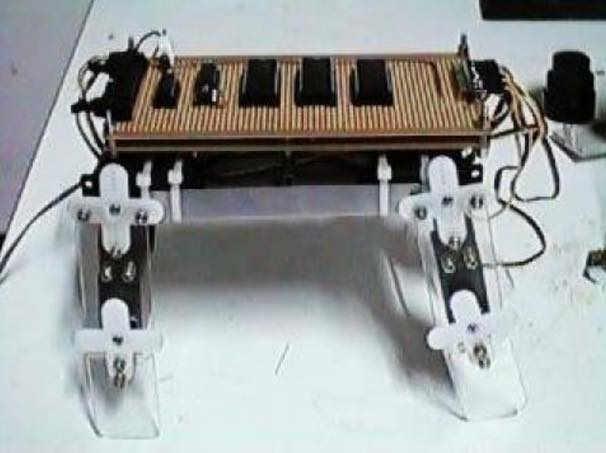

### 6축 로봇

* 시기 : 1996년
* 소개 : 6축 다관절 로봇 Hexis입니다.
* 특징 : 동아리에 처음 가입하고 선배님들하고 동아리 친구들과 같이 만든 작품입니다.
* 기여 : 전체 구조 설계를 맡았으며, 특히 그립 부분은 제가 직접 설계한대로 그대로 제작이 되었습니다.
* 자료 : [Hexis 제작](http://mecha.namoweb.net/xe/Robot/426)
* 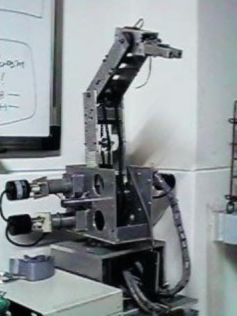

## 관련 문서

* [이력서](2016-07-12-Resume.md)
* [경력 기술서](2016-07-21-Employment-Highlight.md)
* [자기 소개서](2016-07-21-Cover-Letter.md)
