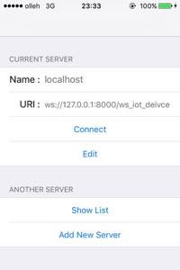
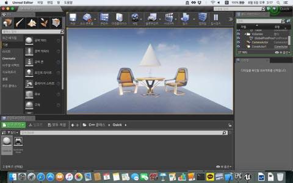
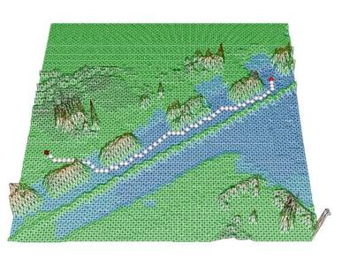
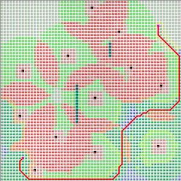
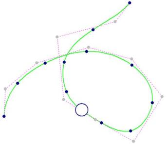
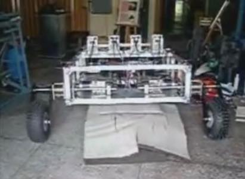
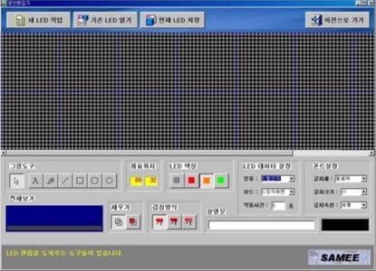
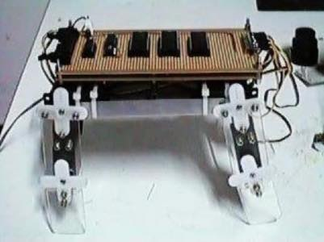
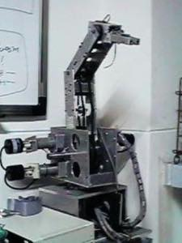

### Information

* Name : **Kim, Min Ho**
* Photo : 
* Birth : 1976-04-24

* Phone : +82-010-2561-9570
* E-Mail : <a href="mailto:{{ site.email }}">{{ site.email }}</a>

### Career Path

#### 2022

* **2022-05-12** : Num Baseball 게임 출시 - 날짜 확인 필요

#### 2021

* **2021-08-05** : SwiftUI 스터디 모임 **Steppers** 종료 (확인 필요) 

#### 2020

* **2020-12** : Swift Programming Language (스위프트 프로그래밍 언어) 1차 번역 완료
* **2020-10** : API Design Guidelines (API 설계 지침) 번역
* **2020-08** : MVVM (모델-뷰-뷰모델) 번역 참여
* **2020-08** : SwiftUI: MVVM 이해하기 작성
* **2020-06-28** : SwiftUI 스터디 모임 **Steppers** 시작 

#### 2019
#### 2018
#### 2017

* **2017-05-08** : 신성 FA 입사
* **2017-04** : 리멘 퇴사

#### 2016

* **2016-09** : PC 검수 시스템 개발 참여 (2016-09 ~ 2017-04)
* **2016-09** : 리멘 입사

* **2016-05~** : 모바일용 [96 대리운전](https://itunes.apple.com/us/app/96daeliunjeon/id1119085448?mt=8) 앱의 iOS 버전 제작
* **2016-03~** : 모두의연구소 [**Swift** 프로그래밍 스터디](http://www.modulabs.co.kr/Swift_library/848) 모임 연구실장 (2016-03 ~ 2016-09)
* **2016-02** : [LunaIoT 프로젝트](https://github.com/kmansoo/Luna/)에 참여하여 RESTful API를 활용하여 iOS 앱 제작
* **2016-01~** : 대안 대학원인 [모두의연구소](http://www.modulabs.co.kr/) 매니저
* **2016-01~** :  모두의연구소 가상현실 연구실 모임 **[VRtooN](http://www.modulabs.co.kr/Swift_library/848)** 연구원 (2016-01 ~ 2016-09 확인은 필요함)
* **2016-01~** : Swift 관련 블로그 ( [http://xho95.github.io](http://xho95.github.io) ) 운영

* 
*  - 일자 확인 필요
*  - 이게 의미가 있나?

#### 2015

* **2015-08~** : 분당 Swift 스터디 모임 **[StudyiOS](http://studyios.gitlab.io)** 참여 시작 (종료 일정 알아보자)
* **2015-08-06** : iOS용 게임 [Space Caravan](https://itunes.apple.com/kr/app/space-caravan/id1011757460?mt=8) 출시
* **2015-01~** : 네이버 D2 스터디 "파이썬을 이용한 머신러닝" 참여 시작 (2015-01 ~ 2015-06)
* **2015-01~** : 수원 [**C++** 스터디 모임](http://cafe.naver.com/multism) 참여 시작 (2015-01 ~ 2017-01)
* **2015** : [선형 대수](https://www.facebook.com/groups/1045080912185263/) 스터디 모임 참여 - **SVD** (Singular Value Decomposition) 부분 발표

> 밑에는 좀 더 확인하자!

* C++ 소스 기반의 홈런 게임 Swift로 포팅 - 뭔지 좀 더 찾고, 일정도 좀 더 확인하자
* **[RayWenderlich](https://www.raywenderlich.com)** 사이트의 게임 강좌 다수 실습 : [포트폴리오](2016-07-21-Portfolio.md) 참고 - 포트폴리오로 일정 확인하자

#### 2014

* **2014-11~** : 1인 소프트웨어 개발 기업 **Void Systems** 창업
* **2014-10** : 부산대학교 기계공학부 박사 중단
* **2014-09** : [부산 모바일 앱 센터](http://www.bmac.kr/index.asp) Unity 게임 개발 / 스타트업을 위한 마케팅 교육 수강 (2014-09 ~2014-10)
* **2014** : [A UGV Hybrid Path Generation Method by using B-spline Curve’s Control Point Selection Algorithm](http://ocean.kisti.re.kr/downfile/volume/icase/JOJDCV/2014/v20n2/JOJDCV_2014_v20n2_138.pdf)

#### 2013

* **2013-10** : URAI 논문 제출 [UGV optimal path planning algorithm by using 3D survivability map](https://ieeexplore.ieee.org/abstract/document/6677377)
* **2013-09** : ICIRA 논문 제출 [3D Probability Map Building for UGV Navigation in Special Environment](https://link.springer.com/chapter/10.1007/978-3-642-40852-6_61)

* C++로 **3차원 격자 지도 생성 알고리즘** 개발 - 논문 설명 : 센서로부터 취득한 기본 데이터인 점군 데이터로부터 격자 형태의 3D 지도를 만드는 알고리즘입니다. 모든 방향으로 대칭인 격자를 만들기 때문에, 공간 격자 내에서 로봇의 최단 경로를 계획할 수 있습니다. 

* **2013-02** : 부산대학교 기계공학부 박사 수료

#### 2012

* **2012-11** : URAI 논문 제출 [The development of the battle field simulation program using the survivability on the probability map](https://ieeexplore.ieee.org/abstract/document/6463003) 
* **2012-08** : ICIRA 논문 제출 [A Study of New Path Planning Algorithm Using Extended A* Algorithm with Survivability](https://link.springer.com/chapter/10.1007/978-3-642-33503-7_59) 
* **2012-06** : IAS 논문 제출 [A Study of Path Planning Algorithm Based on the Survival Probability](https://link.springer.com/chapter/10.1007/978-3-642-33926-4_72) 

* C++로 생존율을 고려한 **확장된 A* 경로 탐색 알고리즘** 개발 - 논문 설명 : 군사용 로봇의 무인 자율 주행을 위해서 주위의 위험 요소들을 고려한 후 가장 안전하면서도 효율적인 경로를 찾는 알고리즘 입니다. 최단 경로를 찾는 알고리즘인 A\* 알고리즘을 확장하여 구현하였습니다.

*   
* 

#### 2011

* **2011-11** : URAI 논문 제출 [A path planning algorithm using artificial potential field based on probability map](https://ieeexplore.ieee.org/document/6145929)
* **2011-03** : 특수 환경 Navigation/Localization 로봇 기술 연구 참여 (2011-03 ~ 2013-12)

#### 2010

* **2010-10** : ICCAS 논문 제출 [A path generation method for path tracking algorithms that use the augmented reality](http://ieeexplore.ieee.org/xpl/articleDetails.jsp?reload=true&arnumber=5670133), [DBPIA 링크](https://www.dbpia.co.kr/journal/articleDetail?nodeId=NODE02025899&language=ko_KR&hasTopBanner=true)
* **2010-03** : 부산대학교 기계공학부 박사 입학 - 계측제어 연구실

* C++로 **B-spline 곡선 경로 생성 프로그램** 개발 - 논문 설명 : 실제 무인 자율 주행 로봇이 이동할 수 있는 부드러운 경로를 만들기 위해 B-spline 곡선 방정식을 이용하여 주어진 통과점을 지나는 곡선 경로 생성 알고리즘을 만들었습니다. 그리고 이 경로를 추종하는 시뮬레이션을 수행했습니다. (2006년 부터 이어짐)

#### 2009
#### 2008
#### 2007

* **2007-02** : 부산대학교 기계공학부 석사 졸업

#### 2006

* C++로 **B-spline 곡선 경로 생성 프로그램** 개발 

* 군사용 로봇인 **[Field Robot](https://www.youtube.com/watch?v=nrXtmwM93FE)** 제작

  

#### 2005

* **2005-03** : 국방과학연구소 자율주행로봇 시스템 개발 참여 (2005-03 ~ 2007-02)
* **2005-03** : 부산대학교 기계공학부 석사 입학 - CAE 연구실
* **2005-02** : 부산대학교 기계공학부 학부 졸업

#### 2004
#### 2003

* **2003-12** : 주식회사 CMK 개발팀 인턴 근무 종료
* **C++ Builder** 로 부산 **지하철 문안 편집기** 개발 

* 

#### 2002

* **2002-01** : 주식회사 CMK 개발팀 인턴 근무 시작 (2002-01 ~ 2003-12)

#### 2001
#### 2000
#### 1999

* **1999-08** : 부산대학교 로봇동아리 [Mechatronics](http://mecha.namoweb.net/xe/) 회장 임기 종료

#### 1998

* **1998** : 4족 보행 로봇 [네발이](http://mecha.namoweb.net/xe/Robot/428)의 제어 프로그램 개선
* **1998-09** : 부산대학교 로봇동아리 [Mechatronics](http://mecha.namoweb.net/xe/) 회장 임기 시작 (1998-08 ~ 1999-07 인지 1998-09 ~ 1999-08 인지 확인 필요함)
* **1998-08** : 군복무 완료

*   

#### 1997
#### 1996

* **1996-06** : 군복무 시작
* **1996** : 6축 다관절 로봇 [Hexis](http://mecha.namoweb.net/xe/Robot/426)  제작
* **1996** : **C++** 로 DOS용 게임 **Sonar** 제작

* 

#### 1995

* **1995-03** : **C**/**C++** 프로그래밍 시작
* **1995-03** : 부산대학교 로봇동아리 **Mechatronics** 가입
* **1995-03** : 부산대학교 기계공학부 학부 입학
* **1995-02** : 부산 금성 고등학교 졸업

#### 1994
#### 1993
#### 1992

* **1992-03** : 부산 금성 고등학교 입학

#### 1991
#### 1990

	

## 관련 문서

* [포트폴리오](2016-07-21-Portfolio.md)
