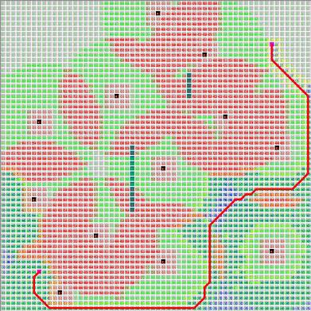
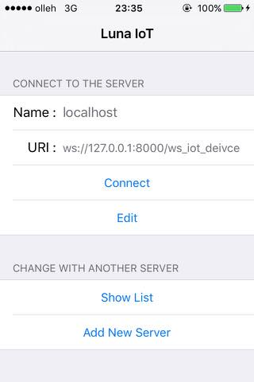
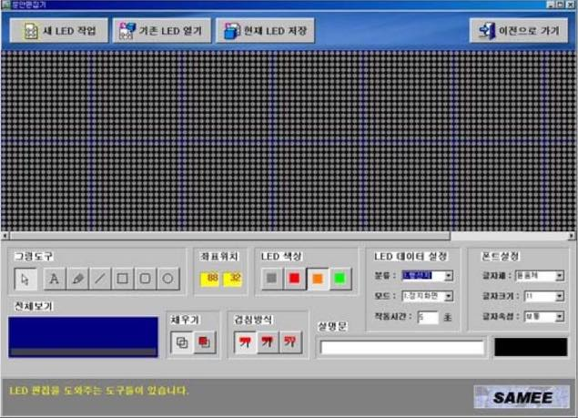

## 포트폴리오

* 제가 만들어 봤던 작품들을 게임 관련 작품과 그외 작품들로 구분하여 시간 역순으로 배치하였습니다.

## 게임 관련 작품들

* 직접 출시 또는 제작해봤던 게임들과 게임에 사용될 수 있는 알고리즘을 소개합니다.
* 개발 언어 : Swift, C++ 

## Vehicle : 게임 포팅

* 일자 : 2016년
* 장르 : 액션
* 소개 : 폰의 기울기로 차량을 제어하는 물리엔진이 적용된 간단한 3D 게임입니다.
* 특징 : Apple에서 Objective-C로 공개한 게임을 **Swift**로 옮겼습니다.
* 기술 : **Swift, SceneKit, GCD, Physics**
* 

## 태양계 만들기

* 시기 : 2016년 제작
* 소개 : Apple에서 공개한 SceneKit 프레임웍으로 만든 간단한 태양계입니다.
* 특징 : 3D 게임에서 각 요소(Node)들의 상하관계를 실습하기 위해 제작했습니다.
* 기술 : **SceneKit, SKNode, Physics, Image**
* 

## Space Caravan : 게임 출시

* 일자 : 2015년 출시
* 장르 : 퍼즐
* 소개 : 서로 보이지 않는 상대방을 적은 턴으로 먼저 찾아서 없애는 2D 퍼즐 게임입니다.
* 특징 : Game Center를 사용하여 게임 순위 등을 볼 수 있습니다.
* 진행 : 현재 2D로 만든 게임을 3D로 옮기기 위해 준비중입니다.
* 동작 : YouTube
* 기술 : **SpriteKit, GameCenter, AVPlayer, Algorithm**
* 

## 홈런 : 게임 제작

* 일자 : 2015년 제작
* 장르 : 퍼즐
* 소개 : 임의의 3자리 숫자를 숫자의 위치에 따른 정보를 바탕으로 맞추는 퍼즐 게임입니다.
* 특징 : C++ 소스를 기반으로 하여 Swift 버전을 제작하였습니다.
* 진행 : 원래 **watchOS**용 게임으로 기획된 것으로 TableView 기반의 UI를 준비중에 있습니다. 
*  

## CatMaze : 실습

* 시기 : 2015년 제작 
* 장르 : 횡스크롤 어드벤처 퍼즐
* 소개 : 화면을 터치하면서 고양이를 이동시키며 뼈다귀를 찾아 개를 제거하고 목적지에 도달하는 2D 게임입니다.
* 특징 : 게임내에 경로 탐색 알고리즘인 A* 알고리즘이 직접 구현되어 있습니다.
* 기술 : **SpriteKit, AVPlayer, Algorithm**
* 

## 피에르 : 실습

* 시기 : 2015년 제작
* 장르 : 횡스크롤
* 소개 : 펭귄이 날라다니면서 적을 피하고 동전을 많이 모으는 게임입니다.
* 특징 : 게임관련 책을 보면서 직접 실습한 것으로 게임 효과 부분을 학습하기 위해 실습 하였습니다.
* 기술 : **SpriteKit, Effect, Mapping**
* 

## 악어 : 실습

* 시기 : 2015년 제작
* 장르 : 터치 퍼즐
* 소개 : 터치로 줄을 끊어서 악어 입에 파인애플을 넣는 게임입니다.
* 특징 : 2D 물리엔진을 학습하기 위해 실습 하였습니다.
* 기술 : **SpriteKit, Physics, Mapping**
* 

## Candy Crush : 실습

* 시기 : 2015년 제작
* 장르 : 퍼즐
* 소개 : 애니팡류의 2D 게임입니다.
* 특징 : 전체 게임도 게임이지만 특히 레벨 디자인을 학습하기 위해 실습한 게임입니다.
* 기술 : **SpriteKit, Effect, Leveling**
* 

## 슈팅 : 실습

* 시기 : 2014년 제작
* 장르 : 슈팅
* 소개 : 화면을 가로지르는 적들을 표창으로 죽이며 적이 화면 반대편에 도달하면 끝나는 게임입니다.
* 특징 : Swift로 처음 만들어본 게임으로 Swift 자체를 익히기 위해 실습하였습니다.
* 기술 : **SpriteKit, CoreAnimation**
* 

## Unity 

* 시기 : 2014년
* 소개 : BMAC 강의 수강

## 3차원 격자 지도 생성 알고리즘 

* 시기 : 2010년 ~ 2013년
* 소개 : 점군 데이터에서 3차원 지도를 생성하는 알고리즘입니다.
* 특징 : C++ Builder로 개발하였습니다.
* 기술 : **OpenGL, A* Algorithm, C++, STL**
* 

## Extended A* 경로 생성 알고리즘 

* 시기 : 2010년 ~ 2013년
* 소개 : 생존율을 고려하여 적들의 공격을 받는 환경에서 최선의 경로를 탐색하도록 A*를 확장한 경로 계획 알고리즘입니다.
* 특징 : C++ Builder로 개발하였으며 게임내 인공지능에 적용할 수 있습니다.
* 기술 : **A* Algorithm, C++, STL, AI**
* 

## B-Spline 곡선 경로 생성 알고리즘

* 시기 : 2006년
* 소개 : 조정점을 사용하여 연속 곡선 경로를 생성하는 알고리즘입니다.
* 특징 : 게임에 응용 가능
* 기술 : **B-Spline Algorithm, C++, STL, Mathematics**
* 

## Sonar : 게임

* 시기 : 1995년 
* 소개 : Space Caravan의 원형이 되는 게임으로 동작 방식이 유사합니다.
* 특징 : C++로 구현하였으며 DOS 상에서 브레젠헴 알고리즘 사용하여 였습니다.
* 기술 : **Algorithm, C++, Mathematics**
* 스크린샷은 DOS 용 게임이라 아쉽지만 없으며, 현재는 소스코드만 가지고 있습니다.

## 96대리운전 

* 시기 : 2016년
* 소개 : 대리운전앱
* 특징 : WebView 기반으로 동작하는 대리운전앱입니다.
* 기술 : **WebView, NSURL, TabBar, FCM**

## LunaIoT 개발

* 시기 : 2016년
* 소개 : Luna 프레임웍 기반의 IoT용 컨트롤러입니다.
* 기술 : ****
* 

## Field Robot

* 시기 : 2006년
* 소개 : 장애물을 넘나드는 군사용 로봇입니다. 
* 특징 : 6개의 팔이 달린 바퀴를 가지고 장애물을 넘을 수 있습니다. 약 300kg의 무게를 들기위해 모터 토크 계산을 수행했습니다.
* 동작 : [YouTube 동작 영상](https://www.youtube.com/watch?v=nrXtmwM93FE)
* 

## Field Robot 모형

* 시기 : 2005년
* 소개 : 레고 마인드스톰으로 구현한 Field Robot 모형입니다. 
* 특징 : 실제 로봇을 만들기 전에 모형으로 가능성을 테스트하기 위해 제작하였습니다.
* 동작 : [Lego 영상](https://www.youtube.com/watch?v=Wq7Q9rYvYxc)

## 지하철 LED 문안 편집기

* 시기 : 2003년
* 소개 : 부산 지하철내의 LED 전광판에 사용할 문안을 작성하는 편집기입니다.
* 특징 : 현재도 몇몇 지하철에서는 이 때 작성된 문장이 사용되고 있습니다. 
* 

## 기어 치형 설계 프로그램

* 시기 : 2000년(?)
* 소개 : 
* 자료 찾아보자.

## Trailer 프로그램

* 시기 : 
* 소개 : 
* 스크린샷은 없는 프로그램입니다.

## 4족 보행 로봇

* 시기 : 1999년
* 소개 : 초창기에 RC 모터로 만든 강아지 로봇 네발이입니다. 
* 특징 : 동아리 친구가 만든 로봇의 버그를 수정하여 동작을 개선했습니다. 
* 기여 : 네발이 로봇의 소스를 개선한 후에 홈페이지에 소스를 오픈하여 당시에 로봇 개발하던 사람들에게 도움을 주었습니다.
* 자료 : 동아리 링크
* 

## 6축 로봇

* 시기 : 1996년
* 소개 : 6축 다관절 로봇 Hexis입니다.
* 특징 : 동아리에 처음 가입하고 선배님들하고 동아리 친구들과 같이 만든 작품입니다.
* 기여 : 전체 구조 설계를 맡았으며, 특히 그립 부분은 제가 직접 설계한대로 그대로 제작이 되었습니다.
* 자료 : 동아리 링크
* 

## 관련 문서

* [이력서](2016-07-12-Resume.md)
* [경력 기술서](2016-07-21-Experience-Statement.md)
* [자기 소개서](2016-07-21-Biographical.md)
