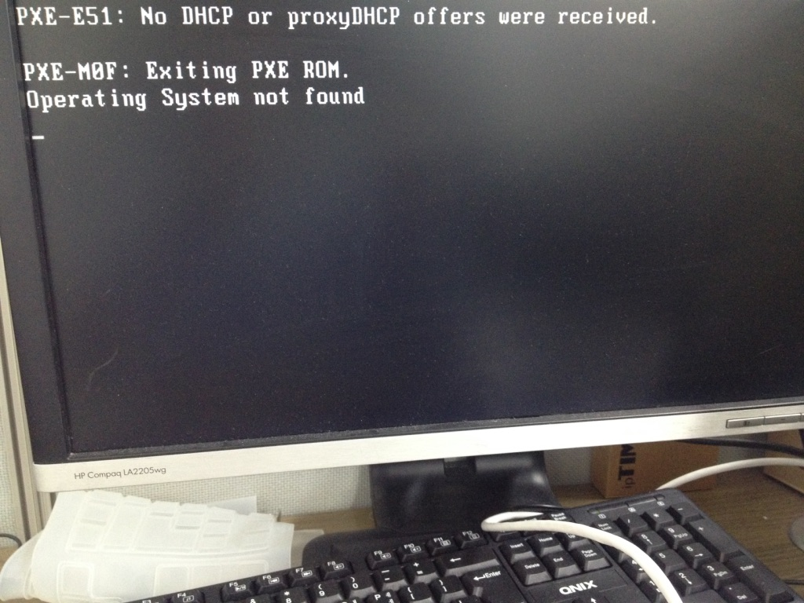
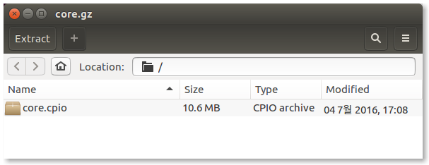

Thank you for your reply.

However, as your reply, Tiny Core linux would be booted well within the PXE system.

But in my case, it doesn't work as shown below.

I only extracted and re-compressed the Tiny Core linux, but did nothing else.

And core.cpio is the only difference.

