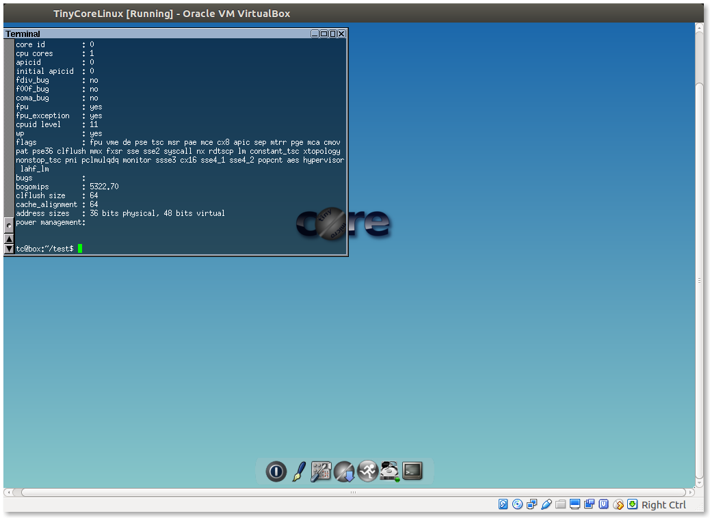
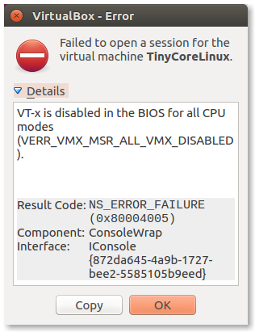

First I installed Tiny Core Linux on the VirtualBox for the Ubuntu 16.04.

Then, I set a develop environment for Tiny Core Linux with command as shown below. 

```
$ tce-load -wi compiletc 
```

I made some simple file open programs with C and C++, and it seemed to work well.



However, someday, after the ubuntu sleep mode, Tiny Core linux on the VirtualBox was broken with an Error code below. 



Since then, Tiny Core Linux has not been executed. I have been searching some solution with Google search, but those are not helpful. 

Reinstalling of VirtualBox and Tiny Core Linux isn't the solution, too.

If there is any solution about this issue, please tell me. 
