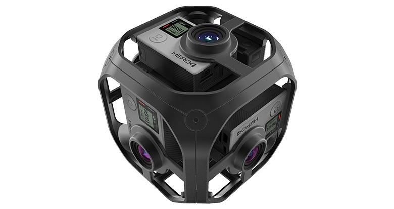

### 사업명

중고 폰을 활용한 VR 촬영 시스템

### 사업 목표

* 사용되지 않는 중고폰을 재활용하여 VR 촬영 시스템을 제작하여 관련 기술을 국산화하고 자원 효율 및 환경 개선에 기여 - 말을 고치자

### 사업 개요

### 사업 내용

### 사업 배경 및 필요성

* 가트너에 따르면 현재 컴퓨터 시장은 지속적으로 그 규모가 감소하고 있으며 PC 업체의 변화가 필요한 시점임 [^ciokorea-31309]
* 모바일 시대를 맞아, 컴퓨터는 플랫폼으로서 중요성이 많이 감소된 상황임 [^policy]
* 컴퓨터 제조 기술은 정체기를 맞고 있어서, 중고 컴퓨터를 계속 사용하기에 무리가 없음 [^macnews-4462] [^cpudb] [^namu-4GHz]
* 집에 있는 PC를 사용하지 않거나 업그레이드를 하지 않는 악순환이 반복됨
* 현재 신규 PC 수요는 VR과 관련이 많음 [^chosun-2016112800041] [^thegames]
* 하지만 VR과 같은 3D 기술은 이제 태동기이며 기술 선점을 위한 노력이 필요함

### 사업 기대 효과

* 사용하지 않는 중고 컴퓨터를 활용할 수 있는 기술에 대한 연구가 필요
* 인공지능 시대를 대비해서 집에서 놀고 있는 컴퓨터를 활용하여 부가가치를 창출할 수 있는 방안 필요
* 중고 컴퓨터에 새생명을 불어넣어 새로운 수요 창출 및 기술 선도 

* TensorFlow는 클러스터링 기술도 활용할 수 있을 것 같음

### 기타 설명 : 참고해서 넣자

#### 중고 컴퓨터로 알고리즘 개발

3차원 지도 생성 및 경로 탐색 알고리즘

중고 맥프로에 그래픽 카드 업그레이드면 개발 가능

인공지능 분야에 진입

OpenCV를 기반으로 지도 제작과 경로 탐색에 Deep Learning 방법을 적용

가능한 이유 : 컴퓨터 기술의 정체로 인해 집에 소유하고 있는 중고 컴퓨터로도 계산을 수행할 수 있음

관공서에서 업그레이드 하는 컴퓨터에 몇몇 업그레이드로 유용한 계산 수행 가능

컴퓨터 자체는 일반 시장 수요 감소로 공급이 충분함, 연산을 위해 새로운 컴퓨터 자원에 투자할 필요없이 중고 컴퓨터를 활용 가능함

3D 기술은 현재 트랜드임

3D 프린터

가상 현실, 증강 현실

드론 - 3D 공간에서 이동하므로 3D 경로 계획이 필요함

PC는 3D 컨텐츠를 생성해내는 훌륭한 장비가 될 수 있음 - 모바일로는 한계가 있음

### 예전 자료

> #### R&D 사업명
> 
> * 공장 및 물류 자동화를 위한 iBeacon 위치 인식 기반의 자율 이송 로봇 및 모바일 기기용 통합 제어 시스템 개발
> 
> #### R&D 사업 목표
> 
> * iBeacon 등의 실내 GPS를 활용한 절대 위치 인식 기반의 자율 이송 로봇을 개발하고 이를 위한 모바일 기기용 통합 제어 솔루션을 제공함으로써, 정해진 라인에 의존하는 기존 이송 로봇의 한계를 극복하고 공장 및 물류 자동화 관련 로봇 기술의 국산화 및 국제 경쟁력 향상에 기여
> 
> #### R&D 사업 개요
> 
> * 사용자가 모바일 기기로 목적지 입력하면 로봇이 iBeacon으로 위치를 인식하여 이송 (실시간 모니터링 및 명령 수정 가능)
> 
> #### R&D 사업 내용
> 
> * 실내 GPS 기술(iBeacon 등)을 사용하여 절대 위치 인식 기반의 자율 이송 로봇 개발
> * 자율 이송 로봇의 관리를 위해 PC 외에 모바일 기기용 통합 제어 프로그램 개발
> * 시제품 제작을 통하여 제품 개발 노하우 및 기술 습득 후 관련 기술 특허 확보, 솔루션 제공
> * 서비스, 국방 등 다양한 분야의 로봇 개발에 사용할 수 있는 단위 플랫폼 개발
> 
> #### R&D 사업 배경 및 필요성
> 
> * 미국 Amazon사의 Drone과 같이 선진국에서는 공장 및 물류 자동화에 첨단 IT, 로봇 기술이 도입되는 추세
> * 국내에서는 산업 현장에서 무인 반송차 등이 사용되고 있으나 실내 환경에서는 GPS를 사용할 수 없기 때문에 공장 바닥에 매설된 라인을 추종하는 방식으로 이동함
> * 이러한 라인 추종 방식의 경우 이동 패턴이 정해져 있어 공정 변화시에 전체 라인을 재설치해야 하며 로봇 동작도 재설정 해야 하므로 유지보수 비용이 상승하고 작업 환경 변화 등에 유연한 대처가 어려움
> * 이를 보완하기 위해 최근 천장의 랜드마크를 사용하는 방식도 개발되었으나 경로 변경시에 랜드마크를 재설치해야 하는 문제는 동일하며, 본질적으로 공장이나 물류 창고는 천장이 높기 때문에 랜드마크 방식은 부적합함
> * iBeacon은 블루투스4.0 LE(Low Energy)기반의 저전력, 저비용 기기로 반경 50m 범위에서 5cm 오차의 실내 위치를 측정할 수 있어 무인 자율 이송 로봇을 위한 기술로 적합하며 이를 토대로 하는 무인 로봇 플래폼에 대한 연구 필요
> 
> #### R&D 사업 기대 효과
> 
> * 비라인 매설 방식을 사용하여 초기 설치 비용 절감 효과 및 공정 변화 등의 상황에서 유지 보수 비용 감소
> * 자율 이송 로봇을 위한 모바일 기기용 제어 프로그램을 제공하여 실시간 이송 상황 모니터링 및 사용자 명령 입력
> * 향후 솔루션 개발로 축적된 기술을 통해 자율 이송 로봇 뿐만 아니라 다양한 이동 로봇의 플랫폼으로 활용
> * 첨단 IT 및 로봇 기술을 물류 자동화에 연계하는 선진국의 흐름에 대응하고 관련 기술 국산화 및 국제 경쟁력 제고

### 참고 자료

[^ciokorea-31309]: ["PC 사업, 2020년에 전면 개편하거나 철수해야" 가트너](http://www.ciokorea.com/news/31309)

[^policy]: [방통위, ‘16년 방송매체 이용행태조사 결과발표](http://www.korea.kr/policy/pressReleaseView.do?newsId=156174772)

[^macnews-4462]: [컴퓨터 시장을 움직이는 힘: 무어의 법칙에서 사용자 경험으로](http://macnews.tistory.com/4462)

[^cpudb]: [Clock Frequency](http://cpudb.stanford.edu/visualize/clock_frequency)

[^namu-4GHz]: [4GHz의 벽](https://namu.wiki/w/4GHz의%20벽)

[^chosun-2016112800041]: [VR의 힘… 콘솔게임·PC를 부활시키다](http://biz.chosun.com/site/data/html_dir/2016/11/28/2016112800041.html)

[^thegames]: [PCㆍ콘솔 기반 VR 시장 '절반의 성공'](http://www.thegames.co.kr/news/articleView.html?idxno=194419)

### 관련 자료

아래의 자료는 한 번 더 조사해서 업데이트할 필요가 있습니다.

[3D공간정보 활용범위 무궁무진...재난방재, 게임,영화,비행 시뮬레이터](http://www.g-enews.com/ko-kr/view.php?ud=201612221855208315344_1)

#### 3D 실내 지도

[한바퀴 돌면 3D실내지도가 '뿅'…삼성·구글 '눈독'](http://www.hellodd.com/?md=news&mt=view&pid=53559)

[최신 소식: 구글의 실내지도(Indoor Maps)는 어디까지 가능할까?](http://www.sphinfo.com/google-indoor-maps/)

[2021년부터 실내지도 실시간으로 업데이트된다](http://www.msn.com/ko-kr/news/national/2021년부터-실내지도-실시간으로-업데이트된다/ar-AAlENXy)

[카메라 6개 달린 네이버의 첫 로봇 M1, 실내 3D 지도 제작](http://blog.naver.com/PostView.nhn?blogId=tnkfree&logNo=220875801838)

[Tango](https://get.google.com/tango/) : 구글의 AR 플랫폼인 것 같습니다.

#### 3D 지도

[애플의 크라우드 소싱(Cloud Sourcing) 3D 지도 제작 특허](http://hlifeinfo.tistory.com/536)

**Cartographer**

Cartographer is a system that provides real-time simultaneous localization and mapping (SLAM) in 2D and 3D across multiple platforms and sensor configurations.

[구글, 위치 인식해 지도 제작하는 기술 오픈소스로 공개!](http://blog.naver.com/PostView.nhn?blogId=enterprisedb&logNo=220833412472)

[Introducing Cartographer](https://opensource.googleblog.com/2016/10/introducing-cartographer.html)

[Cartographer](https://github.com/googlecartographer)

#### 경로 탐색 알고리즘

[미로탐색 알고리즘](https://namu.wiki/w/미로탐색%20알고리즘)

[A* & D* algorithm](http://airkims.tistory.com/51)

[D\*](https://en.wikipedia.org/wiki/D*)

**D\***

[D*-Lite Class](https://github.com/xho95/dstar-lite) 

[D* Lite (D Star Lite)](https://github.com/azampagl/robotics-d-star-lite)

#### 특허 

[특허청, 중소기업의 직무발명 제도확산 적극 추진](http://www.kipo.go.kr/kpo/user.tdf?a=user.news.notice.BoardApp&c=1003&seq=15441&board_id=notice&catmenu=m05_02_01_02)

[특허 전자 출원 시, 중소기업 감면혜택 받기 (70% 감면 혜택)](http://ooz.co.kr/38)

[간단한 특허 전략이 강한 중소기업을 만든다.](http://www.hankyung.com/news/app/newsview.php?aid=201511278274a)

[나는 특허로 평생 월급 받는다: 구글 도서](https://books.google.co.kr/books?id=XPVzCQAAQBAJ&pg=PT130&lpg=PT130&dq=중소기업+특허+혜택&source=bl&ots=WVBGVPYml3&sig=AH9mLgcM_uij_9f3BrIPG9apG2U&hl=ko&sa=X&ved=0ahUKEwjMuMbXvKLRAhWEnZQKHc67D-44ChDoAQg0MAQ#v=onepage&q=중소기업%20특허%20혜택&f=false) : 일상생활 속에서 떠오른 아이디어로 물건을 발명했다면 특허보다는 실용신안 출원을 권한다. 무형의 것은 무조건 특허로 출원해야 하지만, 유형의 것은 특허도 출원 가능하고 실용신안도 가능하다는 얘기다.

[Launching the graph in a distributed session](https://www.tensorflow.org/get_started/basic_usage#launching_the_graph_in_a_distributed_session) : TensorFlow 도 클러스터링 기술을 활용할 수 있는 것 같습니다. 

