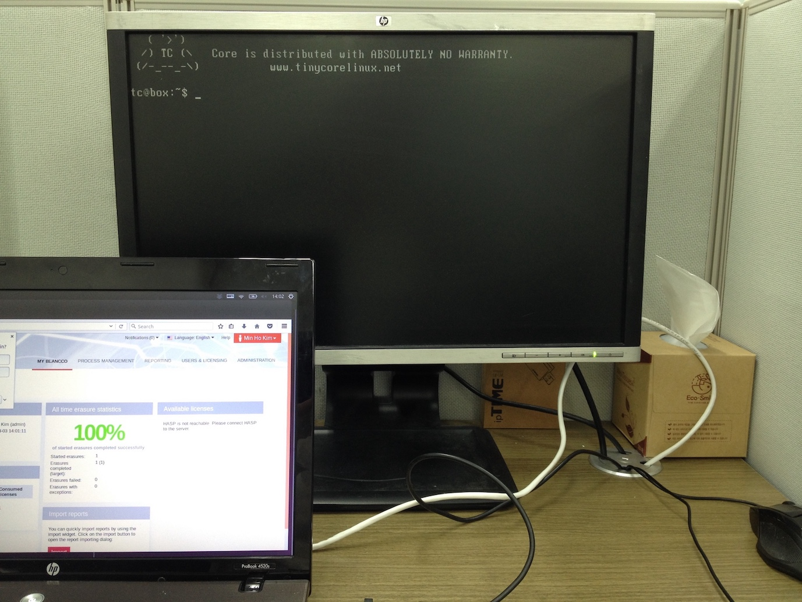
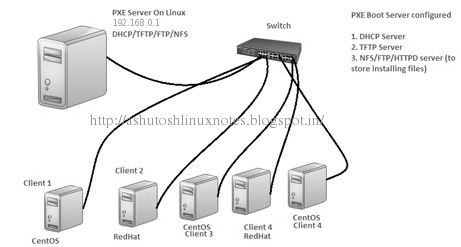
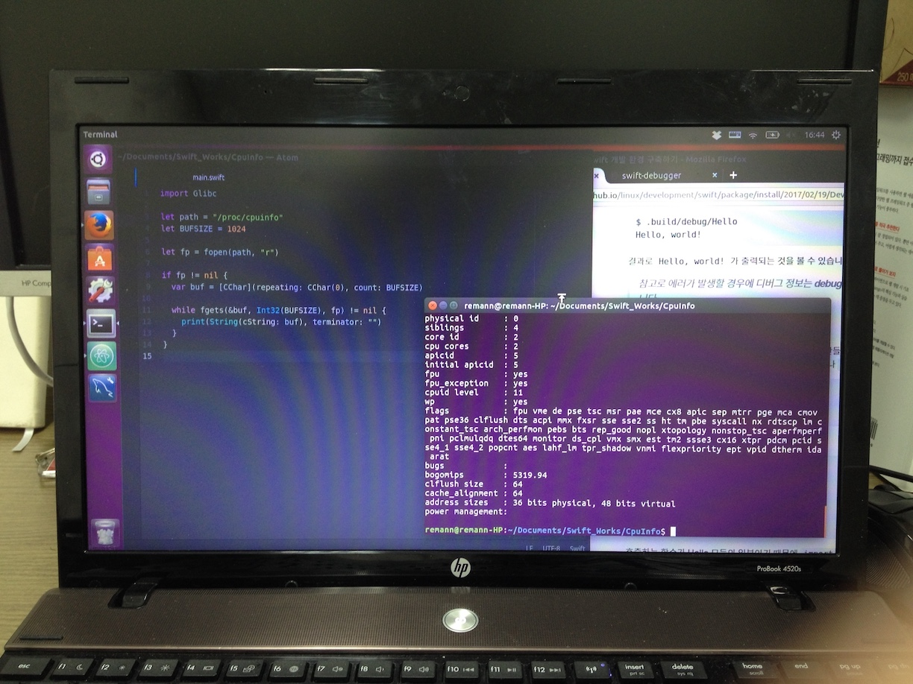

## 해야할 일

최종 목표는 PXE 부팅 가능하도록 구성된 네트웍 시스템에 100대 정도의 PC를 맞물린 후 각 PC 의 하드웨어 정보를 서버 PC 로 전송하도록 하는 프로그램을 제작하는 것입니다.

기본은 메모리의 리눅스로 부팅한 컴퓨터에서 네트웍 서버에 있는 DB 로 자신의 하드웨어 정보를 보내기만 하면 됩니다.

일단 전체 밑그림을 그릴 수 있어도 좋을 것 같습니다.

### 지금까지의 상황

현재는 네트웍 프로그래밍을 하기 전에 부팅용 커스텀 리눅스 ISO 제작까지 진행된 상황입니다.

### PXE 부팅 환경 구축 

1대 1 PXE 부팅 테스용 환경은 구축완료 했습니다. 

최종적으로는 약 100대 정도의 PC 를 테스트할 수 있는 시스템을 구축할 예정입니다. 

참고 자료: [PXE 네트워크 부팅을 통한 OS 설치 자동화](http://blog.pages.kr/156)

### 현재의 시스템

핀란드의 Blancco 시스템 사용

* Apache Tomcat 웹 서비스 사용
* MySQL DB 사용 : 3066 포트 (?)

### PC 정보 취득

리눅스의 경우 **/proc** 디렉토리의 파일을 열어서 정보를 취할 수 있는 것 같습니다. 

### 질문

DB 연동은 ORM 없이 SQL 로 구현해야 하는가?

